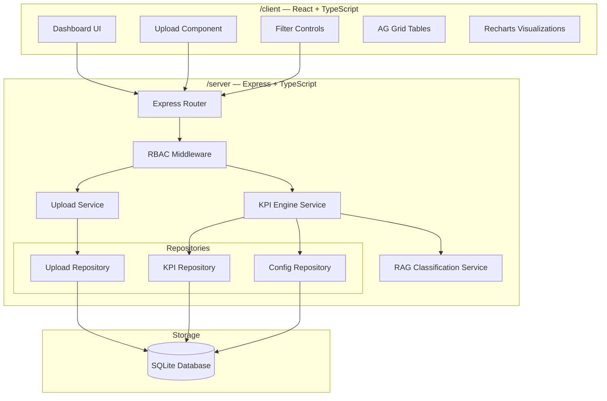
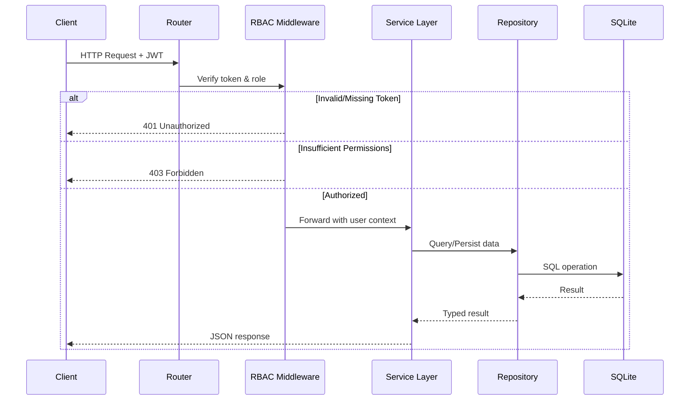
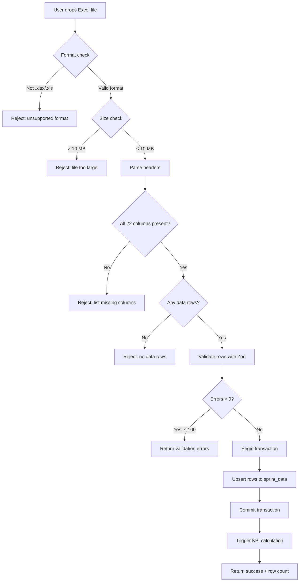

# Design Document: Engineering Health & Delivery Governance Platform

## Overview

The Engineering Health & Delivery Governance Platform is an internal web application that automates tracking of engineering delivery health. The system ingests sprint data via Excel upload, computes 9 KPIs with RAG classification, and presents results on an executive dashboard. The architecture follows a clear client/server split with TypeScript throughout.

### Key Design Decisions

1. **Monorepo with independent packages** — `/client` and `/server` each have their own `package.json`, build scripts, and `tsconfig.json` with `strict: true`. No workspace tooling required for MVP.
2. **SQLite for persistence** — Single-file database, zero infrastructure overhead, suitable for an internal tool with moderate data volume (bounded at 10,000 rows per upload).
3. **Repository Pattern** — All SQLite access is abstracted behind repository interfaces, enabling future migration to PostgreSQL or another store.
4. **Service Layer** — Business logic (KPI calculations, RAG classification) lives in service modules that depend only on repository interfaces.
5. **Stubbed RBAC** — JWT validation uses a local secret with pre-generated tokens for 4 mock users. No external IdP in MVP.
6. **Zod for validation** — Schema-first validation on all API inputs and Excel row parsing, providing typed error messages.

---

## Architecture

### System Architecture Diagram



### Request Flow



### Upload Processing Flow



---

## Components and Interfaces

### Server-Side Components

#### 1. RBAC Middleware (`/server/src/middleware/rbac.ts`)

```typescript
interface DecodedToken {
  userId: string;
  role: 'Admin' | 'Engineering_Manager' | 'Delivery_Manager' | 'Leadership';
  iat: number;
  exp: number;
}

interface AuthenticatedRequest extends Request {
  user: { userId: string; role: string };
}

// Route permission configuration
const ROUTE_PERMISSIONS: Record<string, string[]> = {
  '/api/upload': ['Admin', 'Engineering_Manager'],
  '/api/dashboard/*': ['Admin', 'Engineering_Manager', 'Delivery_Manager', 'Leadership'],
  '/api/config/*': ['Admin'],
  '/api/reports/*': ['Engineering_Manager', 'Delivery_Manager', 'Leadership'],
  '/api/filters/*': ['Admin', 'Engineering_Manager', 'Delivery_Manager', 'Leadership'],
};
```

#### 2. Upload Service (`/server/src/services/upload.service.ts`)

```typescript
interface UploadResult {
  success: boolean;
  rowsIngested: number;
  uploadId: string;
  timestamp: string;
}

interface ValidationError {
  row?: number;
  field: string;
  message: string;
}

interface IUploadService {
  processFile(buffer: Buffer, filename: string, userId: string): Promise<UploadResult>;
  validateColumns(headers: string[]): ValidationError[];
  validateRows(rows: unknown[]): ValidationError[];
}
```

#### 3. KPI Engine Service (`/server/src/services/kpi-engine.service.ts`)

```typescript
type KpiName = 
  | 'sprint_commitment' | 'release_success_rate' | 'deployment_frequency'
  | 'capacity_utilization' | 'ai_efficiency' | 'uat_predictability'
  | 'dev_cycle_time' | 'story_drop_rate' | 'rollback_rate';

type RagStatus = 'green' | 'amber' | 'red';

interface KpiResult {
  kpiName: KpiName;
  value: number | null;
  ragStatus: RagStatus;
  percentChange: number | null;
  insufficientData: boolean;
}

interface KpiFilter {
  team?: string;
  portfolio?: string;
  project?: string;
  startDate?: string;
  endDate?: string;
}

interface IKpiEngineService {
  calculateAll(filter: KpiFilter): Promise<KpiResult[]>;
  calculateSingle(kpiName: KpiName, filter: KpiFilter): Promise<KpiResult>;
}
```

#### 4. RAG Classification Service (`/server/src/services/rag.service.ts`)

```typescript
interface ThresholdConfig {
  kpiName: KpiName;
  greenThreshold: number;
  amberThreshold: number;
  redThreshold: number;
  comparisonType: 'above' | 'below' | 'trend';
}

interface IRagService {
  classify(kpiName: KpiName, value: number, previousValue?: number | null): RagStatus;
  classifyWithTrend(currentValue: number, previousValue: number): RagStatus;
}
```

#### 5. Repositories (`/server/src/repositories/`)

```typescript
// Sprint data repository
interface ISprintDataRepository {
  bulkUpsert(rows: SprintDataRow[], uploadId: string): Promise<number>;
  findByFilter(filter: KpiFilter): Promise<SprintDataRow[]>;
  findByJiraIdAndTeam(jiraId: string, team: string): Promise<SprintDataRow | null>;
  countByUpload(uploadId: string): Promise<number>;
}

// KPI results repository
interface IKpiResultsRepository {
  save(result: KpiComputedResult): Promise<void>;
  saveBatch(results: KpiComputedResult[]): Promise<void>;
  findLatest(filter: KpiFilter): Promise<KpiComputedResult[]>;
  findTrend(kpiName: KpiName, team: string, periods: number): Promise<KpiComputedResult[]>;
}

// Config repository
interface IConfigRepository {
  getThresholds(): Promise<ThresholdConfig[]>;
  getThreshold(kpiName: KpiName): Promise<ThresholdConfig>;
  updateThreshold(kpiName: KpiName, config: Partial<ThresholdConfig>): Promise<void>;
  getTeamConfig(teamName: string): Promise<TeamConfig | null>;
  getAllTeams(): Promise<TeamConfig[]>;
  upsertTeamConfig(config: TeamConfig): Promise<void>;
  getTrackPortfolioMapping(): Promise<Record<string, string>>;
}
```

### Client-Side Components

#### 1. Dashboard Page (`/client/src/pages/Dashboard.tsx`)

- Renders 9 KPI tiles in a responsive 3×3 grid
- Each tile: KPI name, current value, RAG badge (colored dot), percentage change with arrow
- Filter bar at top: portfolio dropdown, team dropdown, date range picker
- Trend chart section below tiles using Recharts

#### 2. Upload Page (`/client/src/pages/Upload.tsx`)

- HTML5 drag-and-drop zone with visual feedback
- Client-side pre-validation (file type, file size)
- Progress indicator during upload/processing
- Result display: success (row count) or error list (row/field/message table)

#### 3. Shared Components

| Component | Library | Purpose |
|-----------|---------|---------|
| `KpiTile` | Custom | Displays single KPI value + RAG + change |
| `KpiTrendChart` | Recharts | Line/bar chart for 6-period trends |
| `DataTable` | AG Grid | Tabular data with sort/filter/pagination |
| `FilterBar` | Custom | Portfolio, team, date range selection |
| `FileDropZone` | Custom | Drag-and-drop with format validation |
| `RagBadge` | Custom | Colored indicator (Green/Amber/Red) |

### API Endpoints

| Method | Path | Role(s) | Description |
|--------|------|---------|-------------|
| POST | `/api/upload` | Admin, Engineering_Manager | Upload Excel file |
| GET | `/api/dashboard/kpis` | All authenticated | Get KPI values with RAG status |
| GET | `/api/dashboard/trends` | All authenticated | Get trend data for charts |
| GET | `/api/filters/portfolios` | All authenticated | List available portfolios |
| GET | `/api/filters/teams` | All authenticated | List teams (optionally filtered by portfolio) |
| GET | `/api/filters/projects` | All authenticated | List projects |
| GET | `/api/config/thresholds` | Admin | Get RAG threshold config |
| PUT | `/api/config/thresholds` | Admin | Update RAG thresholds |
| GET | `/api/config/teams` | Admin | Get team capacity config |
| PUT | `/api/config/teams/:teamName` | Admin | Update team capacity |
| GET | `/api/auth/me` | All authenticated | Get current user info |
| GET | `/api/auth/mock-users` | Dev only | List mock user tokens |

---

## Data Models

### SQLite Schema

```sql
-- Raw sprint delivery data from Excel uploads
CREATE TABLE sprint_data (
  id INTEGER PRIMARY KEY AUTOINCREMENT,
  upload_id TEXT NOT NULL REFERENCES uploads(id),
  sno INTEGER NOT NULL,
  team TEXT NOT NULL,
  track TEXT NOT NULL,
  project TEXT NOT NULL,
  portfolio TEXT NOT NULL,
  status TEXT,
  items_list TEXT,
  walkthrough_given_on TEXT,
  jira_id TEXT NOT NULL,
  estimated_effort_without_ai REAL,
  actual_effort_with_ai REAL,
  ai_used TEXT CHECK(ai_used IN ('Y', 'N')),
  dev_start_date TEXT,
  dev_end_date TEXT,
  development_status TEXT,
  uat_delivery_date TEXT,
  uat_delivery_target TEXT,
  resources TEXT,
  go_live_planned_date TEXT,
  go_live_date TEXT,
  production_status TEXT,
  rollback TEXT CHECK(rollback IN ('Y', 'N')),
  rollback_reason TEXT,
  story_drop_reason TEXT,
  ingested_at TEXT NOT NULL DEFAULT (strftime('%Y-%m-%dT%H:%M:%SZ', 'now')),
  UNIQUE(jira_id, team)
);

-- Upload tracking
CREATE TABLE uploads (
  id TEXT PRIMARY KEY,
  file_name TEXT NOT NULL,
  uploaded_by TEXT NOT NULL,
  rows_ingested INTEGER NOT NULL DEFAULT 0,
  status TEXT CHECK(status IN ('processing', 'success', 'failed')) DEFAULT 'processing',
  error_message TEXT,
  uploaded_at TEXT NOT NULL DEFAULT (strftime('%Y-%m-%dT%H:%M:%SZ', 'now'))
);

-- Computed KPI results
CREATE TABLE kpi_results (
  id INTEGER PRIMARY KEY AUTOINCREMENT,
  kpi_name TEXT NOT NULL,
  value REAL,
  rag_status TEXT CHECK(rag_status IN ('green', 'amber', 'red')),
  percent_change REAL,
  team TEXT,
  portfolio TEXT,
  sprint TEXT,
  period_start TEXT NOT NULL,
  period_end TEXT NOT NULL,
  calculated_at TEXT NOT NULL DEFAULT (strftime('%Y-%m-%dT%H:%M:%SZ', 'now')),
  insufficient_data INTEGER DEFAULT 0
);

-- Team configuration (capacity, portfolio mapping)
CREATE TABLE team_config (
  id INTEGER PRIMARY KEY AUTOINCREMENT,
  team_name TEXT NOT NULL UNIQUE,
  portfolio TEXT NOT NULL,
  capacity_hours_per_sprint REAL NOT NULL DEFAULT 0,
  updated_at TEXT NOT NULL DEFAULT (strftime('%Y-%m-%dT%H:%M:%SZ', 'now'))
);

-- Track-to-Portfolio mapping
CREATE TABLE track_portfolio_mapping (
  id INTEGER PRIMARY KEY AUTOINCREMENT,
  track TEXT NOT NULL UNIQUE,
  portfolio TEXT NOT NULL
);

-- RAG threshold configuration
CREATE TABLE rag_thresholds (
  id INTEGER PRIMARY KEY AUTOINCREMENT,
  kpi_name TEXT NOT NULL UNIQUE,
  green_threshold REAL,
  amber_threshold REAL,
  red_threshold REAL,
  comparison_type TEXT CHECK(comparison_type IN ('above', 'below', 'trend')) NOT NULL,
  updated_at TEXT NOT NULL DEFAULT (strftime('%Y-%m-%dT%H:%M:%SZ', 'now'))
);

-- Stubbed user accounts
CREATE TABLE users (
  id TEXT PRIMARY KEY,
  username TEXT NOT NULL UNIQUE,
  role TEXT CHECK(role IN ('Admin', 'Engineering_Manager', 'Delivery_Manager', 'Leadership')) NOT NULL,
  token TEXT NOT NULL
);

-- Indexes for common queries
CREATE INDEX idx_sprint_data_team ON sprint_data(team);
CREATE INDEX idx_sprint_data_portfolio ON sprint_data(portfolio);
CREATE INDEX idx_sprint_data_project ON sprint_data(project);
CREATE INDEX idx_sprint_data_dev_start ON sprint_data(dev_start_date);
CREATE INDEX idx_sprint_data_jira_team ON sprint_data(jira_id, team);
CREATE INDEX idx_kpi_results_lookup ON kpi_results(kpi_name, team, portfolio, period_start);
```

### TypeScript Domain Models

```typescript
// Core domain types
interface SprintDataRow {
  id?: number;
  uploadId: string;
  sno: number;
  team: string;
  track: string;
  project: string;
  portfolio: string;
  status: string | null;
  itemsList: string | null;
  walkthroughGivenOn: string | null;
  jiraId: string;
  estimatedEffortWithoutAi: number | null;
  actualEffortWithAi: number | null;
  aiUsed: 'Y' | 'N' | null;
  devStartDate: string | null;
  devEndDate: string | null;
  developmentStatus: string | null;
  uatDeliveryDate: string | null;
  uatDeliveryTarget: string | null;
  resources: string | null;
  goLivePlannedDate: string | null;
  goLiveDate: string | null;
  productionStatus: string | null;
  rollback: 'Y' | 'N' | null;
  rollbackReason: string | null;
  storyDropReason: string | null;
  ingestedAt: string;
}

interface KpiComputedResult {
  id?: number;
  kpiName: KpiName;
  value: number | null;
  ragStatus: RagStatus;
  percentChange: number | null;
  team: string | null;
  portfolio: string | null;
  sprint: string | null;
  periodStart: string;
  periodEnd: string;
  calculatedAt: string;
  insufficientData: boolean;
}

interface TeamConfig {
  id?: number;
  teamName: string;
  portfolio: string;
  capacityHoursPerSprint: number;
  updatedAt: string;
}

interface UploadRecord {
  id: string;
  fileName: string;
  uploadedBy: string;
  rowsIngested: number;
  status: 'processing' | 'success' | 'failed';
  errorMessage: string | null;
  uploadedAt: string;
}
```

### Zod Validation Schemas

```typescript
import { z } from 'zod';

const dateStringSchema = z.string().refine(
  (val) => /^\d{2}-\d{2}-\d{4}$/.test(val) || /^\d{4}-\d{2}-\d{2}/.test(val),
  { message: 'Date must be in DD-MM-YYYY or ISO 8601 format' }
);

const excelRowSchema = z.object({
  sno: z.number().int().positive().max(99999),
  team: z.string().min(1).max(500),
  track: z.string().min(1).max(500),
  project: z.string().min(1).max(500),
  status: z.string().max(500).nullable().default(null),
  itemsList: z.string().max(500).nullable().default(null),
  walkthroughGivenOn: dateStringSchema.nullable().default(null),
  jiraId: z.string().min(1).regex(/^[A-Z]+-\d+$/, 'Must match JIRA project key pattern'),
  estimatedEffortWithoutAi: z.number().min(0).max(999).nullable().default(null),
  actualEffortWithAi: z.number().min(0).max(9999).nullable().default(null),
  aiUsed: z.enum(['Y', 'N']).nullable().default(null),
  devStartDate: dateStringSchema.nullable().default(null),
  devEndDate: dateStringSchema.nullable().default(null),
  developmentStatus: z.string().max(500).nullable().default(null),
  uatDeliveryDate: dateStringSchema.nullable().default(null),
  uatDeliveryTarget: dateStringSchema.nullable().default(null),
  resources: z.string().max(500).nullable().default(null),
  goLivePlannedDate: dateStringSchema.nullable().default(null),
  goLiveDate: dateStringSchema.nullable().default(null),
  productionStatus: z.string().max(500).nullable().default(null),
  rollback: z.enum(['Y', 'N']).nullable().default(null),
  rollbackReason: z.string().max(500).nullable().default(null),
  storyDropReason: z.string().max(500).nullable().default(null),
});

const kpiFilterSchema = z.object({
  portfolio: z.string().optional(),
  team: z.string().optional(),
  project: z.string().optional(),
  startDate: z.string().regex(/^\d{4}-\d{2}-\d{2}$/).optional(),
  endDate: z.string().regex(/^\d{4}-\d{2}-\d{2}$/).optional(),
});

const thresholdUpdateSchema = z.object({
  kpiName: z.enum([
    'sprint_commitment', 'release_success_rate', 'deployment_frequency',
    'capacity_utilization', 'ai_efficiency', 'uat_predictability',
    'dev_cycle_time', 'story_drop_rate', 'rollback_rate'
  ]),
  greenThreshold: z.number(),
  amberThreshold: z.number(),
  redThreshold: z.number().optional(),
  comparisonType: z.enum(['above', 'below', 'trend']),
});
```

### Track-to-Portfolio Default Mapping

| Track | Portfolio |
|-------|-----------|
| IBPS-POS | IBPS-POS |
| IBPS-Dolphin | IBPS-Dolphin |
| IBPS-Claims | IBPS-Claims |
| mPro | mPro |
| E-Commerce | E-Commerce |
| POSV/IVC | POSV/IVC |

Stored in `track_portfolio_mapping` table and seeded during migration. Admin can modify via configuration.

---

## Correctness Properties

*A property is a characteristic or behavior that should hold true across all valid executions of a system — essentially, a formal statement about what the system should do. Properties serve as the bridge between human-readable specifications and machine-verifiable correctness guarantees.*

### Property 1: Column Validation Correctness

*For any* set of column headers from an uploaded Excel file, the validation function SHALL accept the file if and only if all 22 required columns are present, and when rejecting, the reported missing columns SHALL be exactly the set difference between the required columns and the provided columns.

**Validates: Requirements 1.2, 1.3**

### Property 2: Row Data Validation Accuracy

*For any* Excel data row containing randomly generated invalid field values (wrong types, out-of-range numbers, malformed dates, invalid patterns), the row validator SHALL report a validation error identifying the correct row number and the exact field name for each violation.

**Validates: Requirements 1.4**

### Property 3: Persistence Row Count Invariant

*For any* valid Excel file with N data rows (where 1 ≤ N ≤ 10,000), after successful processing the Upload_Service SHALL return a row count equal to N, and querying the Data_Store SHALL confirm exactly N rows were persisted for that upload (accounting for upsert deduplication).

**Validates: Requirements 1.5**

### Property 4: Data Persistence Round-Trip

*For any* valid sprint data row, persisting it to the Data_Store and then querying it back SHALL return all 22 original field values unchanged, plus a portfolio field correctly derived from the Track field via the Track-to-Portfolio mapping.

**Validates: Requirements 2.1**

### Property 5: Query Filter Correctness

*For any* dataset and any combination of team, portfolio, project, and date range filters, all rows returned by a Data_Store query SHALL satisfy every specified filter condition, and no matching rows SHALL be omitted from the result.

**Validates: Requirements 2.4**

### Property 6: Transaction Atomicity on Failure

*For any* batch persistence operation that fails at an arbitrary row position, the Data_Store SHALL contain zero rows from that batch after the failure (complete rollback).

**Validates: Requirements 2.5**

### Property 7: Upsert Deduplication

*For any* set of rows containing duplicate JIRA ID + team combinations, after persistence the Data_Store SHALL contain exactly one record per unique (jira_id, team) pair, with field values matching the last-written row for that pair.

**Validates: Requirements 2.6**

### Property 8: Sprint Commitment Calculation

*For any* set of sprint items with random Development Status values, the KPI_Engine SHALL calculate Sprint_Commitment as (count where Development Status = "Complete" / total item count) × 100, rounded to 2 decimal places.

**Validates: Requirements 3.1, 3.12**

### Property 9: Release Success Rate Calculation

*For any* set of items with random GO Live Date and Rollback flag values, the KPI_Engine SHALL calculate Release_Success_Rate as (count with non-empty GO Live Date AND Rollback = "N" / count with non-empty GO Live Date) × 100, rounded to 2 decimal places.

**Validates: Requirements 3.2, 3.12**

### Property 10: Deployment Frequency Calculation

*For any* set of items with random GO Live Date values (including duplicates and empty values), the KPI_Engine SHALL calculate Deployment_Frequency as the count of distinct non-empty GO Live Dates.

**Validates: Requirements 3.3**

### Property 11: Capacity Utilization Calculation

*For any* set of items with random Actual Effort values and a random positive team capacity configuration, the KPI_Engine SHALL calculate Capacity_Utilization as (sum of Actual Effort With AI hours / configured capacity hours) × 100, rounded to 2 decimal places.

**Validates: Requirements 3.4, 3.12**

### Property 12: AI Efficiency Calculation

*For any* set of items where AI Used = "Y" with random positive Estimated Effort and Actual Effort values, the KPI_Engine SHALL calculate AI_Efficiency as the average of ((Estimated - Actual) / Estimated × 100) across all qualifying items, rounded to 2 decimal places.

**Validates: Requirements 3.5, 3.12**

### Property 13: UAT Predictability Calculation

*For any* set of items with both UAT Delivery Date and UAT Delivery Target populated, the KPI_Engine SHALL calculate UAT_Predictability as (count where delivery date ≤ target date / total count with both dates) × 100, rounded to 2 decimal places.

**Validates: Requirements 3.6, 3.12**

### Property 14: Dev Cycle Time Calculation

*For any* set of items with both Dev Start Date and Dev End Date populated (end ≥ start), the KPI_Engine SHALL calculate Dev_Cycle_Time as the average calendar days between start and end dates, rounded to 1 decimal place.

**Validates: Requirements 3.7, 3.12**

### Property 15: Story Drop Rate Calculation

*For any* set of sprint items with random Story Drop Reason values (some empty, some non-empty), the KPI_Engine SHALL calculate Story_Drop_Rate as (count with non-empty Story Drop Reason / total item count) × 100, rounded to 2 decimal places.

**Validates: Requirements 3.8, 3.12**

### Property 16: Rollback Rate Calculation

*For any* set of items with random Rollback flags and GO Live Dates, the KPI_Engine SHALL calculate Rollback_Rate as (count where Rollback = "Y" / count with non-empty GO Live Date) × 100, rounded to 2 decimal places.

**Validates: Requirements 3.9, 3.12**

### Property 17: Filter-Scoped KPI Recalculation

*For any* multi-team dataset and any filter combination (team, portfolio, project, date range), the KPI_Engine SHALL produce KPI values identical to calculating the KPI on only the subset of rows matching all active filters.

**Validates: Requirements 3.10**

### Property 18: Zero Denominator Returns Null

*For any* KPI calculation where the denominator evaluates to zero (e.g., no items in sprint, no items with GO Live Date), the KPI_Engine SHALL return a null value and indicate insufficient data.

**Validates: Requirements 3.11**

### Property 19: Threshold-Based RAG Classification

*For any* numeric KPI value and a threshold-based KPI (Sprint_Commitment, Release_Success_Rate, Capacity_Utilization, AI_Efficiency, UAT_Predictability, Story_Drop_Rate, Rollback_Rate), the classification function SHALL return Green when the value is in the green range, Amber when in the amber range, and Red when in the red range, with no gaps or overlaps between ranges.

**Validates: Requirements 4.1, 4.2, 4.4, 4.5, 4.6, 4.8, 4.9**

### Property 20: Trend-Based RAG Classification

*For any* pair of current and previous period values for trend-based KPIs (Deployment_Frequency, Dev_Cycle_Time), the classification function SHALL return Green when improvement exceeds 5%, Amber when change is within 5% (inclusive), and Red when regression exceeds 5%.

**Validates: Requirements 4.3, 4.7**

### Property 21: Insufficient Trend Data Defaults to Amber

*For any* trend-based KPI (Deployment_Frequency or Dev_Cycle_Time) where fewer than 2 periods of historical data are available, the RAG classification SHALL always return Amber.

**Validates: Requirements 4.10**

### Property 22: JWT Authentication Correctness

*For any* HTTP request, if the Authorization header contains a valid JWT token signed with the correct secret, the RBAC middleware SHALL extract the correct userId and role into the request context; if the token is missing, malformed, expired, or signed with a wrong secret, the middleware SHALL return 401.

**Validates: Requirements 6.1, 6.3, 6.10**

### Property 23: Role-Based Route Authorization

*For any* combination of authenticated user role and API route path, the RBAC middleware SHALL permit the request if and only if the route is in the permitted set for that role, returning 403 otherwise.

**Validates: Requirements 6.4**

---

## Error Handling

### Server-Side Error Strategy

| Error Category | HTTP Status | Response Format | Handling |
|---|---|---|---|
| Invalid file format (.csv, .pdf, etc.) | 400 | `{ success: false, errors: [{ field: "file", message }] }` | Reject before parsing |
| File too large (> 10 MB) | 400 | `{ success: false, errors: [{ field: "file", message }] }` | Multer limit rejects |
| Missing columns | 400 | `{ success: false, errors: [{ field, message }] }` | List all missing columns |
| Invalid row data | 400 | `{ success: false, errors: [{ row, field, message }] }` | Cap at 100 errors |
| Empty file (no data rows) | 400 | `{ success: false, errors: [{ message }] }` | Check after header parse |
| Max rows exceeded (> 10,000) | 400 | `{ success: false, errors: [{ message }] }` | Check row count |
| Authentication failure | 401 | `{ error: string }` | RBAC middleware rejects |
| Authorization failure | 403 | `{ error: string }` | RBAC middleware rejects |
| Resource not found | 404 | `{ error: string }` | Route handler |
| Insufficient KPI data | 200 | KPI value = null, `insufficientData: true` | Graceful partial response |
| Database error | 500 | `{ error: "Internal server error" }` | Log details, generic response |

### Error Handling Principles

1. **Fail fast on invalid input** — Reject files before expensive parsing when format or size is wrong.
2. **Batch error reporting** — Collect up to 100 validation errors per file rather than failing on the first.
3. **Transaction safety** — All batch operations use database transactions; any failure triggers full rollback.
4. **Graceful degradation** — Dashboard renders "No data available" rather than erroring on empty data.
5. **Secure error messages** — Never expose stack traces, SQL queries, or file paths in API responses.
6. **Consistent structure** — All error responses use the same JSON shape per category.

### Client-Side Error Handling

| Scenario | User Experience |
|---|---|
| Network failure | Toast notification with retry option |
| 401 Unauthorized | Redirect to token/user selection |
| 403 Forbidden | Display "Access Denied" with role info |
| Upload validation errors | Error table showing row, field, message |
| No data for selected filters | "No data available" indicator on KPI tiles |
| Server error (5xx) | Generic error toast, log to console |

### Global Error Handler (Express)

```typescript
// /server/src/middleware/error-handler.ts
const errorHandler: ErrorRequestHandler = (err, req, res, next) => {
  if (err instanceof ZodError) {
    return res.status(400).json({ 
      success: false, 
      errors: err.issues.map(i => ({ field: i.path.join('.'), message: i.message }))
    });
  }
  console.error('[ERROR]', err.message, err.stack);
  res.status(500).json({ error: 'Internal server error' });
};
```

---

## Testing Strategy

### Frameworks and Libraries

| Layer | Framework | Libraries |
|-------|-----------|-----------|
| Server unit tests | Vitest | vitest, supertest (API), better-sqlite3 (in-memory DB) |
| Server property tests | Vitest + fast-check | fast-check for property-based testing |
| Client unit tests | Vitest | @testing-library/react, jsdom |
| Integration tests | Vitest | supertest, in-memory SQLite |
| E2E (future) | Playwright | — |

### Property-Based Testing Configuration

- **Library**: fast-check (TypeScript-native PBT library)
- **Minimum iterations**: 100 per property test
- **Tag format**: `Feature: engineering-health-platform, Property {N}: {title}`
- **Location**: `/server/src/__tests__/properties/`
- **Each property** from the Correctness Properties section is implemented as a single `fc.assert(fc.property(...))` test

### Generator Strategy

| Property Group | Generator Approach |
|---|---|
| Column validation (P1) | Random subsets of 22 required column name strings |
| Row validation (P2) | Random objects with mix of valid/invalid field values per Zod schema |
| Persistence round-trip (P3-P4) | Random valid SprintDataRow objects |
| Query filters (P5) | Random multi-team datasets + random filter combinations |
| Transaction atomicity (P6) | Random batch sizes with failure injected at random index |
| Upsert (P7) | Random rows with intentional (jiraId, team) duplicates |
| KPI formulas (P8-P16) | Random arrays of items with varying field values per KPI |
| Filter scoping (P17) | Multi-team datasets with random filter application |
| Zero denominator (P18) | Datasets guaranteed to produce 0-count denominators |
| RAG classification (P19-P21) | Random numeric values 0-200, random (current, previous) pairs |
| JWT auth (P22) | Random valid/invalid token strings and payloads |
| Role auth (P23) | Random (role, route) pairs against permission matrix |

### Unit Tests (Example-Based)

Unit tests complement property tests by covering:

- **Specific examples**: Known file formats (.csv, .pdf rejected; .xlsx accepted)
- **Boundary values**: File size at exactly 10 MB, row count at exactly 10,000
- **Edge cases**: Zero data rows, all items complete, all items dropped
- **Role matrix**: Each of the 4 roles tested against all route groups
- **Mock user accounts**: 4 pre-generated tokens verified as valid
- **Date formats**: Both DD-MM-YYYY and ISO 8601 correctly parsed
- **Dashboard rendering**: KPI tiles render with correct structure and RAG colors
- **Empty state**: "No data available" when filters return nothing

### Integration Tests

- **Full upload pipeline**: Upload Excel → validate → persist → calculate KPIs → verify DB state
- **Database migrations**: Server starts with empty DB, schema initializes correctly
- **API round-trip**: POST upload → GET dashboard → verify KPI values
- **Filter cascading**: Portfolio → team filter → verify scoped results
- **Threshold configuration**: Update thresholds → recalculate → verify new RAG status

### Test Directory Structure

```
/server
  /src
    /__tests__/
      /properties/
        column-validation.property.test.ts    (P1)
        row-validation.property.test.ts       (P2)
        persistence.property.test.ts          (P3-P7)
        kpi-calculations.property.test.ts     (P8-P16)
        kpi-filters.property.test.ts          (P17-P18)
        rag-classification.property.test.ts   (P19-P21)
        rbac.property.test.ts                 (P22-P23)
      /unit/
        upload.service.test.ts
        kpi-engine.service.test.ts
        rag.service.test.ts
        rbac.middleware.test.ts
      /integration/
        upload.integration.test.ts
        dashboard.integration.test.ts
        config.integration.test.ts
/client
  /src
    /__tests__/
      Dashboard.test.tsx
      Upload.test.tsx
      KpiTile.test.tsx
      FilterBar.test.tsx
```

### Coverage Targets

| Module | Target |
|--------|--------|
| KPI Engine (calculations) | 95%+ |
| RAG Classification | 100% |
| Upload Service (validation) | 90%+ |
| Repository Layer | 85%+ |
| RBAC Middleware | 90%+ |
| Client components | 80%+ |
