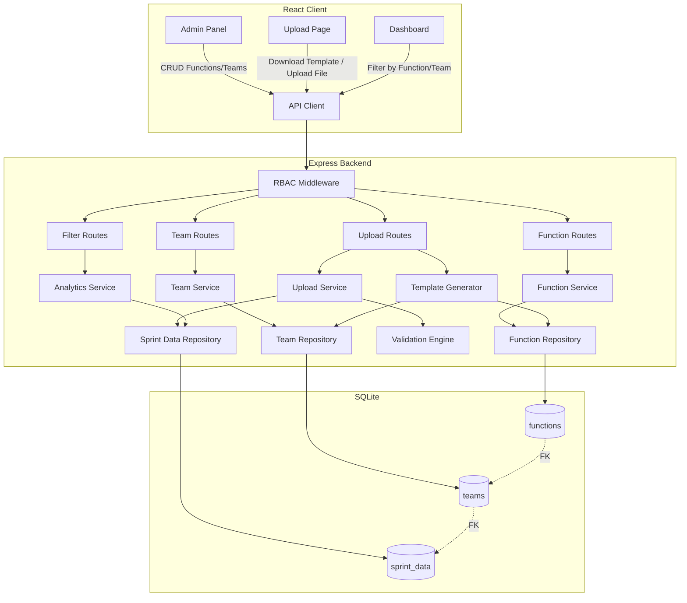
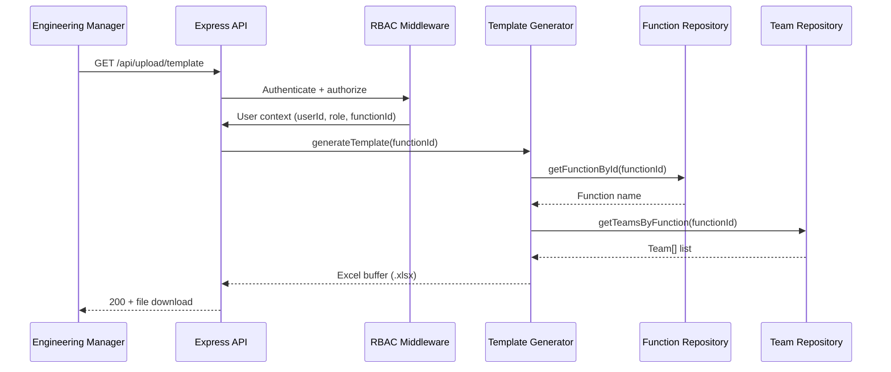
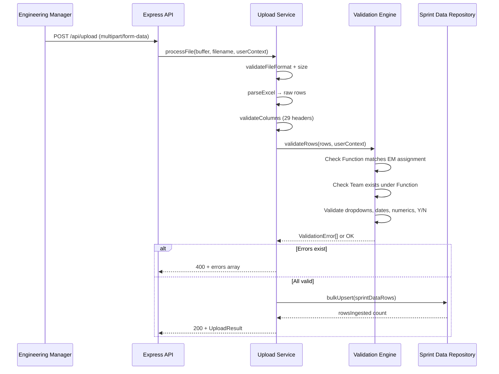

# Design Document: Excel Template Function-Team Hierarchy

## Overview

This design introduces a **Function → Team → Story** organizational hierarchy to replace the current flat "Project" field in the Engineering Health & Delivery Governance Platform's Excel upload workflow. The change separates concerns between business domain (Function), delivery squad (Team), and work item (Story), enabling proper data scoping, role-based access, and hierarchical reporting.

### Key Design Decisions

1. **Separate `functions` and `teams` tables** rather than embedding hierarchy in `sprint_data` — enables admin CRUD without touching delivery data, supports referential integrity, and avoids data duplication.
2. **ExcelJS for template generation** — already a project dependency, supports cell protection, data validation dropdowns, and styled workbook generation.
3. **Zod schema extension** for the revised 29-column template — leverages existing validation pipeline with minimal refactoring.
4. **Migration-based schema evolution** — follows existing `better-sqlite3` migration pattern (sequential numbered files in a transaction).
5. **Function assignment on `users` table** — adds a `function_id` column to the existing users table rather than a separate join table, since each EM maps to exactly one Function.

### Scope Boundaries

- This design covers: template generation, upload validation, data model changes, admin CRUD for Functions/Teams, EM function assignment, cross-function filtering for Leadership/Admin.
- This design does NOT cover: changes to KPI computation logic, dashboard widget redesign, or report export format changes (those consume the new data model but are not structurally changed).

---

## Architecture

### High-Level Architecture



### Request Flow: Template Download



### Request Flow: File Upload



---

## Components and Interfaces

### Server-Side Components

#### 1. Function Repository (`server/src/repositories/function.repository.ts`)

```typescript
export interface IFunctionRepository {
  getAll(): FunctionRecord[];
  getById(id: number): FunctionRecord | null;
  getByName(name: string): FunctionRecord | null;
  create(name: string): FunctionRecord;
  rename(id: number, newName: string): FunctionRecord;
  delete(id: number): void;
  hasTeams(id: number): boolean;
}

export interface FunctionRecord {
  id: number;
  name: string;
  createdAt: string;
}
```

#### 2. Team Repository (`server/src/repositories/team.repository.ts`)

```typescript
export interface ITeamRepository {
  getByFunction(functionId: number): TeamRecord[];
  getById(id: number): TeamRecord | null;
  getByNameAndFunction(name: string, functionId: number): TeamRecord | null;
  create(name: string, functionId: number): TeamRecord;
  rename(id: number, newName: string): TeamRecord;
  delete(id: number): void;
  hasSprintData(id: number): boolean;
}

export interface TeamRecord {
  id: number;
  name: string;
  functionId: number;
  createdAt: string;
}
```

#### 3. Template Generator Service (`server/src/services/template-generator.service.ts`)

```typescript
export interface ITemplateGenerator {
  generateTemplate(userContext: TemplateContext): Promise<Buffer>;
}

export interface TemplateContext {
  functionId: number;
  functionName: string;
  teams: string[];
  dropdownOptions: DropdownConfig;
}

export interface DropdownConfig {
  productionStatus: string[];
  storyStatus: string[];
  delayReason: string[];
}
```

#### 4. Validation Engine (revised) (`server/src/validators/upload.validator.ts`)

```typescript
export interface IUploadValidator {
  validateHeaders(headers: string[]): ValidationError[];
  validateFunctionAssignment(rows: RawRow[], expectedFunction: string): ValidationError[];
  validateTeamMembership(rows: RawRow[], validTeams: string[]): ValidationError[];
  validateDropdowns(rows: RawRow[], config: DropdownConfig): ValidationError[];
  validateFieldTypes(rows: RawRow[]): ValidationError[];
}
```

#### 5. Function Admin Routes (`server/src/routes/function.routes.ts`)

| Method | Path | Role | Description |
|--------|------|------|-------------|
| GET | `/api/admin/functions` | Super_Admin | List all Functions |
| POST | `/api/admin/functions` | Super_Admin | Create Function |
| PUT | `/api/admin/functions/:id` | Super_Admin | Rename Function |
| DELETE | `/api/admin/functions/:id` | Super_Admin | Delete Function |

#### 6. Team Admin Routes (`server/src/routes/team.routes.ts`)

| Method | Path | Role | Description |
|--------|------|------|-------------|
| GET | `/api/admin/functions/:functionId/teams` | Super_Admin | List Teams for Function |
| POST | `/api/admin/functions/:functionId/teams` | Super_Admin | Create Team |
| PUT | `/api/admin/teams/:id` | Super_Admin | Rename Team |
| DELETE | `/api/admin/teams/:id` | Super_Admin | Delete Team |

#### 7. EM Assignment Route

| Method | Path | Role | Description |
|--------|------|------|-------------|
| PUT | `/api/admin/users/:id/function` | Super_Admin | Assign EM to Function |

#### 8. Dropdown Config Routes

| Method | Path | Role | Description |
|--------|------|------|-------------|
| GET | `/api/config/dropdowns` | All authenticated | Get dropdown options |
| PUT | `/api/config/dropdowns/:field` | Super_Admin | Update dropdown options |

### Client-Side Components

#### 1. FunctionManager Component (`client/src/pages/admin/FunctionManager.tsx`)
Admin panel for CRUD operations on Functions. Uses ag-grid for listing and inline editing.

#### 2. TeamManager Component (`client/src/pages/admin/TeamManager.tsx`)
Admin panel for CRUD operations on Teams within a selected Function.

#### 3. Revised FilterBar (`client/src/components/FilterBar.tsx`)
Extended to include Function dropdown (visible to Leadership/Super_Admin only). Team dropdown cascades based on selected Function.

#### 4. AnalyticsFilterBar Enhancement
Adds Function-level filter for cross-function aggregation views.

---

## Data Models

### Database Schema (Post-Migration)

#### `functions` table

| Column | Type | Constraints |
|--------|------|-------------|
| id | INTEGER | PRIMARY KEY AUTOINCREMENT |
| name | TEXT | NOT NULL, UNIQUE (case-insensitive via COLLATE NOCASE) |
| created_at | TEXT | NOT NULL DEFAULT (current timestamp) |

#### `teams` table

| Column | Type | Constraints |
|--------|------|-------------|
| id | INTEGER | PRIMARY KEY AUTOINCREMENT |
| name | TEXT | NOT NULL |
| function_id | INTEGER | NOT NULL, REFERENCES functions(id) |
| created_at | TEXT | NOT NULL DEFAULT (current timestamp) |
| | | UNIQUE(name, function_id) |

#### `sprint_data` table (additions)

| Column | Type | Constraints |
|--------|------|-------------|
| function_name | TEXT | NOT NULL DEFAULT 'Unassigned' |
| story_name | TEXT | |
| actual_effort | REAL | |
| definition_of_ready | TEXT | CHECK(IN ('Y','N')) |
| definition_of_done | TEXT | CHECK(IN ('Y','N')) |
| refinement_closure_date | TEXT | |
| uat_start_date | TEXT | |
| uat_complete_date | TEXT | |
| delay_reason | TEXT | |
| delay_reason_description | TEXT | |

#### `users` table (additions)

| Column | Type | Constraints |
|--------|------|-------------|
| function_id | INTEGER | REFERENCES functions(id), nullable |

#### `dropdown_options` table (new)

| Column | Type | Constraints |
|--------|------|-------------|
| id | INTEGER | PRIMARY KEY AUTOINCREMENT |
| field_name | TEXT | NOT NULL |
| option_value | TEXT | NOT NULL |
| sort_order | INTEGER | NOT NULL DEFAULT 0 |
| created_at | TEXT | NOT NULL DEFAULT (current timestamp) |
| | | UNIQUE(field_name, option_value) |

### New Indexes

```sql
CREATE INDEX idx_sprint_data_function ON sprint_data(function_name);
CREATE INDEX idx_sprint_data_function_team ON sprint_data(function_name, team);
CREATE INDEX idx_teams_function_id ON teams(function_id);
```

### TypeScript Types

```typescript
// New domain types
export interface FunctionRecord {
  id: number;
  name: string;
  createdAt: string;
}

export interface TeamRecord {
  id: number;
  name: string;
  functionId: number;
  createdAt: string;
}

export interface DropdownOption {
  id: number;
  fieldName: 'production_status' | 'story_status' | 'delay_reason';
  optionValue: string;
  sortOrder: number;
}

// Extended SprintDataRow (additions to existing interface)
export interface SprintDataRowExtended extends SprintDataRow {
  functionName: string;
  storyName: string | null;
  actualEffort: number | null;
  definitionOfReady: 'Y' | 'N' | null;
  definitionOfDone: 'Y' | 'N' | null;
  refinementClosureDate: string | number | null;
  uatStartDate: string | number | null;
  uatCompleteDate: string | number | null;
  delayReason: string | null;
  delayReasonDescription: string | null;
}
```

### Revised Excel Row Schema (29 columns)

```typescript
export const revisedExcelRowSchema = z.object({
  sno: z.number().int().positive().max(99999).nullable(),
  function: z.string().min(1).max(100),
  team: z.string().min(1).max(500),
  storyName: z.string().min(1).max(500),
  walkthroughGivenOn: dateStringSchema.nullable(),
  jiraId: z.string().min(1).regex(/^[A-Z0-9]+-\d+$/),
  devStartDate: dateStringSchema.nullable(),
  devCompleteDate: dateStringSchema.nullable(),
  withAiStoryPoints: z.number().min(0).max(99999.99).nullable(),
  uatDeliveryDate: dateStringSchema.nullable(),
  uatDeliveryTarget: dateStringSchema.nullable(),
  resources: z.string().max(500).nullable(),
  goLivePlannedDate: dateStringSchema.nullable(),
  goLiveDate: dateStringSchema.nullable(),
  productionStatus: z.string().max(100).nullable(),
  rollback: z.enum(['Y', 'N']).nullable(),
  rollbackReason: z.string().max(500).nullable(),
  aiUsed: z.enum(['Y', 'N']).nullable(),
  estimatedEffortWithoutAi: z.number().min(0).max(99999.99).nullable(),
  actualEffort: z.number().min(0).max(99999.99).nullable(),
  actualEffortWithAi: z.number().min(0).max(99999.99).nullable(),
  storyStatus: z.string().max(100).nullable(),
  storyDropReason: z.string().max(500).nullable(),
  definitionOfReady: z.enum(['Y', 'N']).nullable(),
  definitionOfDone: z.enum(['Y', 'N']).nullable(),
  refinementClosureDate: dateStringSchema.nullable(),
  uatStartDate: dateStringSchema.nullable(),
  uatCompleteDate: dateStringSchema.nullable(),
  delayReason: z.string().max(100).nullable(),
  delayReasonDescription: z.string().max(2000).nullable(),
});
```

### Migration Strategy

Migration `004-function-team-hierarchy.ts` executes within a single transaction:

1. Create `functions` table
2. Create `teams` table
3. Create `dropdown_options` table
4. Add columns to `sprint_data` (function_name, story_name, actual_effort, DOR, DOD, refinement_closure_date, uat_start_date, uat_complete_date, delay_reason, delay_reason_description)
5. Add `function_id` column to `users` table
6. Seed `functions` with initial values (E-Com, MPro, Dolphin, IVC)
7. Populate `teams` from distinct team values in sprint_data grouped by mapped function
8. Populate `function_name` in existing sprint_data rows using track_portfolio_mapping
9. Create new indexes on sprint_data(function_name) and sprint_data(function_name, team)
10. Seed dropdown_options with initial Production Status, Story Status, Delay Reason values

---

## Correctness Properties

*A property is a characteristic or behavior that should hold true across all valid executions of a system — essentially, a formal statement about what the system should do. Properties serve as the bridge between human-readable specifications and machine-verifiable correctness guarantees.*

### Property 1: Date field validation accepts all supported formats and rejects invalid

*For any* string or number value, the date validator SHALL accept values in DD-MM-YYYY, ISO 8601 (YYYY-MM-DD), DD-MMM-YY, DD-MMM-YYYY format, or valid Excel serial numbers, and SHALL reject all other values.

**Validates: Requirements 1.3, 10.3**

### Property 2: Numeric field validation enforces bounds

*For any* numeric value, the numeric field validator SHALL accept non-negative numbers with at most 2 decimal places not exceeding 99999.99, and SHALL reject negative numbers, numbers exceeding 99999.99, and values with more than 2 decimal places.

**Validates: Requirements 1.4, 10.4**

### Property 3: Text field length validation

*For any* string value, the text field validators SHALL accept strings within the configured maximum length (500 for general text, 2000 for Delay Reason Description, 100 for Function/Team names) and SHALL reject strings exceeding those limits.

**Validates: Requirements 1.6, 1.7, 1.8**

### Property 4: Function name validation rules

*For any* string submitted as a Function name, the validator SHALL accept names between 1 and 100 characters containing only alphanumeric characters, hyphens, spaces, and underscores. It SHALL reject empty strings, whitespace-only strings, strings exceeding 100 characters, and strings containing other special characters. Two function names that differ only in case SHALL be treated as duplicates.

**Validates: Requirements 2.4, 6.1, 6.5, 6.6, 6.7**

### Property 5: Team name validation with within-function uniqueness

*For any* string submitted as a Team name under a given Function, the validator SHALL accept names between 1 and 100 characters after trimming, reject empty/whitespace-only names and names exceeding 100 characters, reject names that duplicate an existing Team within the same Function, and allow the same name to exist under different Functions.

**Validates: Requirements 4.1, 7.1, 7.5, 7.6, 7.9, 7.10**

### Property 6: Function assignment enforcement on upload

*For any* uploaded Excel file by an Engineering Manager, the upload validator SHALL verify that every row's Function value exactly matches (case-sensitive) the EM's assigned Function. If any row has a mismatched, empty, or blank Function value, the entire file SHALL be rejected and no data SHALL be persisted.

**Validates: Requirements 3.3, 3.4, 3.5**

### Property 7: Team membership enforcement on upload

*For any* uploaded Excel row, the validation engine SHALL accept the row's Team value only if it exists in the Team_Registry under the Engineering Manager's assigned Function, and SHALL reject rows with Team values not registered under that Function or that are empty/blank.

**Validates: Requirements 4.6, 4.7, 4.8**

### Property 8: Dropdown value case-insensitive validation

*For any* uploaded row's Production Status, Story Status, or Delay Reason value, the validation engine SHALL accept the value if it matches any configured dropdown option using case-insensitive comparison, SHALL reject non-matching non-empty values, SHALL reject empty Production Status and Story Status (mandatory), and SHALL accept empty Delay Reason (optional).

**Validates: Requirements 9.5, 9.6, 9.7, 9.8**

### Property 9: Query filtering correctness

*For any* set of sprint data entries across multiple Functions and Teams, filtering by a Function SHALL return exactly and only the entries with that Function, and filtering by Function + Team SHALL return exactly and only entries matching both criteria. Empty result sets SHALL be returned when no matches exist.

**Validates: Requirements 5.4, 5.5, 11.3**

### Property 10: Function rename cascades atomically

*For any* Function with associated sprint_data entries, renaming the Function SHALL update both the Function_Registry name and all sprint_data entries referencing the old name, such that after the operation zero entries reference the old name and all formerly-associated entries reference the new name.

**Validates: Requirements 6.2**

### Property 11: Historical data preservation on EM reassignment

*For any* Engineering Manager with previously submitted sprint data under Function A, reassigning the EM to Function B SHALL NOT modify the function_name of any existing sprint_data entries — all previously submitted entries SHALL continue to reference Function A.

**Validates: Requirements 8.3**

### Property 12: Upload-persist round trip

*For any* set of valid Excel rows that pass all validation, persisting them and then querying the sprint_data table SHALL return equivalent data for all 29 fields — the Function, Team, Story Name, JIRA ID, dates, numerics, dropdowns, and text fields SHALL all be preserved without transformation loss.

**Validates: Requirements 10.7**

### Property 13: Migration mapping correctness

*For any* existing sprint_data row with a track value, the migration SHALL set function_name to the Function corresponding to the track's portfolio mapping in track_portfolio_mapping. For rows with no mapping entry, function_name SHALL be set to "Unassigned".

**Validates: Requirements 12.4, 12.5**

---

## Error Handling

### Upload Validation Errors

| Error Scenario | HTTP Status | Response Format |
|---|---|---|
| File exceeds 10MB | 400 | `{ errors: [{ field: "file", message: "..." }] }` |
| Invalid file extension | 400 | `{ errors: [{ field: "file", message: "..." }] }` |
| Missing column headers | 400 | `{ errors: [{ field: "columnName", message: "..." }] }` |
| Zero data rows | 400 | `{ errors: [{ field: "data", message: "..." }] }` |
| Function mismatch | 400 | `{ errors: [{ row: N, field: "Function", message: "Expected 'X', found 'Y'" }] }` |
| Invalid Team | 400 | `{ errors: [{ row: N, field: "Team", message: "Team 'X' not found under Function 'Y'" }] }` |
| Invalid dropdown value | 400 | `{ errors: [{ row: N, field: "fieldName", message: "Invalid value 'X'" }] }` |
| Schema validation (dates, numbers, etc.) | 400 | `{ errors: [{ row: N, field: "fieldName", message: "..." }] }` |

**Error Collection Policy:** Up to 100 errors collected per upload. File-level errors (format, size, columns) short-circuit before row validation. Function mismatch causes immediate full-file rejection.

### Admin CRUD Errors

| Error Scenario | HTTP Status | Response |
|---|---|---|
| Duplicate Function name | 409 | `{ error: "A Function with this name already exists" }` |
| Duplicate Team name in Function | 409 | `{ error: "A Team with this name already exists in this Function" }` |
| Delete Function with Teams | 409 | `{ error: "Cannot delete: Function has associated Teams" }` |
| Delete Team with data | 409 | `{ error: "Cannot delete: Team has associated sprint data entries" }` |
| Invalid Function name format | 400 | `{ error: "Validation failed", details: [...] }` |
| Function not found | 404 | `{ error: "Function not found" }` |
| Team not found | 404 | `{ error: "Team not found" }` |
| Insufficient permissions | 403 | `{ error: "Forbidden. Insufficient permissions for this resource." }` |

### Template Generation Errors

| Error Scenario | HTTP Status | Response |
|---|---|---|
| EM has no Function assignment | 400 | `{ error: "No Function assigned to your account. Contact your administrator." }` |
| Empty Function_Registry | 200 | Template generated with empty dropdown + info message |

### Data Integrity

- All admin mutations (create, rename, delete) use SQLite transactions via `db.transaction()`.
- Function rename updates both `functions.name` and all `sprint_data.function_name` rows atomically.
- Team rename updates both `teams.name` and all `sprint_data.team` rows (within the function) atomically.
- Migration runs entirely within a single transaction; any failure triggers full rollback.

---

## Testing Strategy

### Property-Based Tests (using `fast-check`)

The project already has `fast-check` as a dev dependency. Property tests will be placed in `server/src/__tests__/properties/` and configured to run 100+ iterations each.

| Property # | Test File | Description |
|---|---|---|
| 1 | `date-validation.property.test.ts` | Date format acceptance/rejection |
| 2 | `numeric-validation.property.test.ts` | Numeric bounds validation |
| 3 | `text-length-validation.property.test.ts` | String length enforcement |
| 4 | `function-name-validation.property.test.ts` | Function name rules + uniqueness |
| 5 | `team-name-validation.property.test.ts` | Team name rules + scoped uniqueness |
| 6 | `function-assignment-upload.property.test.ts` | Upload function enforcement |
| 7 | `team-membership-upload.property.test.ts` | Upload team validation |
| 8 | `dropdown-validation.property.test.ts` | Dropdown case-insensitive matching |
| 9 | `query-filtering.property.test.ts` | Filter correctness |
| 10 | `function-rename-cascade.property.test.ts` | Rename atomicity |
| 11 | `em-reassignment-preservation.property.test.ts` | Historical data invariant |
| 12 | `upload-persist-roundtrip.property.test.ts` | Data round trip |
| 13 | `migration-mapping.property.test.ts` | Track→Function mapping |

**Configuration:** Each property test will use `fc.assert(fc.property(...), { numRuns: 100 })` minimum.

**Tag format:** Each test will include a comment:
```typescript
// Feature: excel-template-function-team-hierarchy, Property N: <property text>
```

### Unit Tests (example-based)

| Area | Test File | Covers |
|---|---|---|
| Template column structure | `template-generator.test.ts` | Req 1.1 (exact 29 columns in order) |
| Y/N field validation | `yn-field-validation.test.ts` | Req 1.5, 10.5 |
| Cell protection | `template-protection.test.ts` | Req 3.2 |
| EM no assignment | `template-no-assignment.test.ts` | Req 3.6 |
| Delete with children | `admin-crud.test.ts` | Req 6.3, 6.4, 7.3, 7.4 |
| RBAC on admin endpoints | `admin-rbac.test.ts` | Req 6.8, 7.7, 8.8 |
| Empty Function registry | `empty-registry.test.ts` | Req 2.6 |
| File size/format | `file-validation.test.ts` | Req 10.8 |
| Zero data rows | `empty-file.test.ts` | Req 10.9 |

### Integration Tests

| Area | Test File | Covers |
|---|---|---|
| Function CRUD → Template flow | `function-template-integration.test.ts` | Req 2.2, 2.3, 4.3, 4.4 |
| EM assignment → immediate effect | `em-assignment-integration.test.ts` | Req 8.2 |
| Full upload pipeline | `upload-pipeline-integration.test.ts` | Req 10.7 end-to-end |
| Migration atomicity | `migration-rollback.test.ts` | Req 12.8 |
| Cross-function visibility | `cross-function-visibility.test.ts` | Req 11.1, 11.4, 11.5 |

### Smoke Tests

| Check | Covers |
|---|---|
| Seed functions exist after migration | Req 2.5, 12.6, 12.7 |
| EM initial assignment | Req 8.7 |
| Schema columns present | Req 5.1, 12.1, 12.2, 12.3 |
| Indexes exist | Req 5.7 |

### Test Execution

```bash
# Run all tests
cd server && npx vitest run

# Run only property tests
cd server && npx vitest run src/__tests__/properties/

# Run with coverage
cd server && npx vitest run --coverage
```

