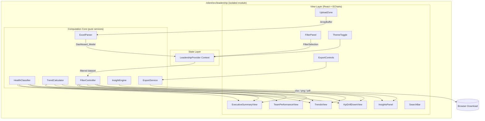
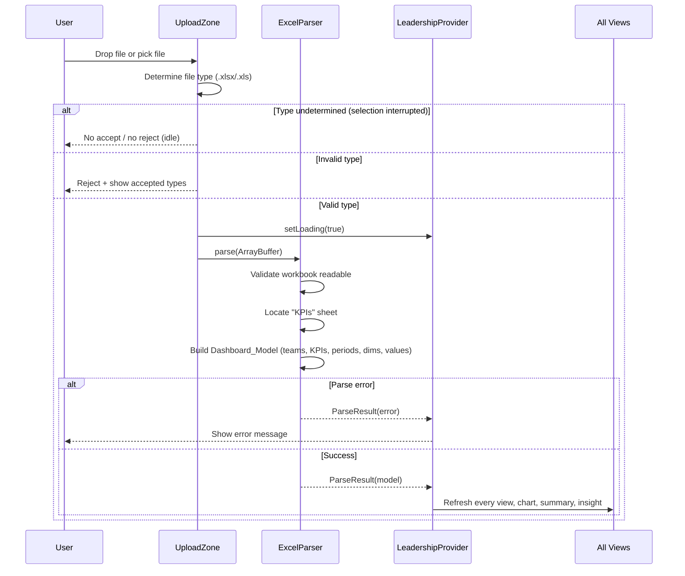
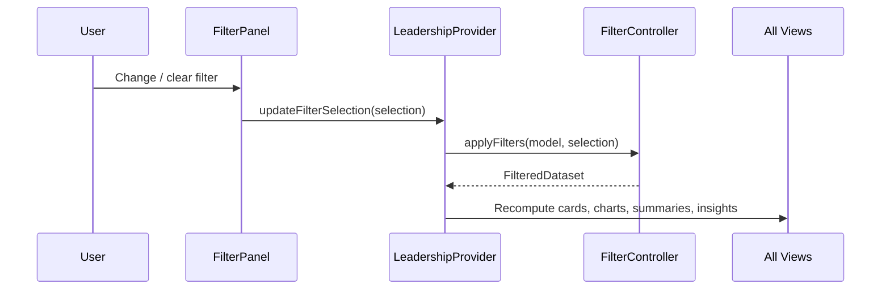

# Design Document: Leadership Dashboard

## Overview

The Leadership Dashboard is a **standalone, client-side, Excel-driven executive reporting module** that lives inside the existing Vite + React + TypeScript client at `/client/src/leadership`. A leader uploads an `.xlsx`/`.xls` workbook whose `KPIs` worksheet is the single source of truth. The module parses the workbook entirely in the browser, builds an in-memory `Dashboard_Model`, and renders every report, trend, comparison, drill-down, and insight from that model — with no backend, network API, or database involvement.

The module is fully isolated from the existing Engineering Health Dashboard. It defines its own components, services, parsers, data model, and state, and is reachable through a dedicated route (`/leadership`). It does not modify or reuse any component that is tightly coupled to the existing dashboard. It MAY reuse loosely-coupled shared utilities (for example the brand palette in `client/src/theme`), per Requirement 14.5.

### Key Design Decisions

1. **In-browser Excel parsing via SheetJS (`xlsx`)** — The existing app uploads Excel to the server for parsing; the Leadership Dashboard cannot use that path because it must be backend-free (Req 14.4). SheetJS reads `.xlsx`/`.xls` from an `ArrayBuffer` in the browser and also writes workbooks for export, which directly supports the round-trip requirement (Req 3). It is added as a client dependency scoped to this module.
2. **Apache ECharts for visualization** — Requirements name ECharts as the preferred library (Req 8, Req 7). ECharts covers line, bar, clustered bar, heat map, radar, and sparkline charts, supports hover tooltips and zoom (`dataZoom`), and exposes `getDataURL()` for PNG export (Req 8.5, 12.4). The existing dashboard uses Recharts; ECharts is introduced only inside the isolated module and does not affect existing charts.
3. **Schema-agnostic ("dynamic") parsing** — The parser derives teams, KPIs, periods, years, and dimensions from the sheet content rather than from a hardcoded schema, so new months/KPIs/teams/years/business units flow into filters and views without code changes (Req 4).
4. **Pure computation core** — Parsing, health classification, trend computation, filtering, and insight generation are pure functions over plain data structures. This isolates business logic from React and ECharts, makes the logic property-testable, and keeps the model backend-free.
5. **React Context for module state** — A single `LeadershipProvider` holds the parsed `Dashboard_Model`, current filter selection, and derived filtered dataset, and exposes them to all views. This avoids prop-drilling and keeps state confined to the module.
6. **Export composition** — Excel export reuses the SheetJS writer; chart PNG export uses ECharts `getDataURL()`; PDF export renders the print-friendly layout (Req 12.5) and captures it to PDF. No server rendering is involved.

### Scope Boundaries

- **In scope:** upload UI, in-browser parsing, dynamic structure detection, health classification, executive summary, team performance, trends, KPI drill-down, global filters, smart insights, search, export (Excel/PDF/PNG), print, light/dark responsive UI, and full module isolation.
- **Out of scope:** any change to the existing Engineering Health Dashboard, server, authentication, or database; persistence of uploaded data across sessions (the model is in-memory only).

---

## Architecture

### High-Level Architecture



### Upload and Parse Flow



### Filter Application Flow



### Directory Layout

```
client/src/leadership/
  index.tsx                     # Module entry, mounts LeadershipProvider + LeadershipShell
  routes.tsx                    # Route element for /leadership
  state/
    LeadershipProvider.tsx      # Context provider (model, filters, theme, loading, error)
    useLeadership.ts            # Hook to consume context
  services/
    excel-parser.ts             # ExcelParser
    health-classifier.ts        # HealthClassifier
    trend-calculator.ts         # TrendCalculator
    filter-controller.ts        # FilterController
    insight-engine.ts           # InsightEngine
    export-service.ts           # ExportService
  model/
    types.ts                    # Dashboard_Model and related types
    pillars.ts                  # KPI → Engineering_Pillar mapping + direction defaults
  components/
    UploadZone.tsx
    FilterPanel.tsx
    ExecutiveSummaryView.tsx
    TeamPerformanceView.tsx
    TrendsView.tsx
    KpiDrillDownView.tsx
    InsightsPanel.tsx
    SearchBar.tsx
    ExportControls.tsx
    ThemeToggle.tsx
    charts/                     # Thin ECharts wrappers (Line, Bar, Heatmap, Radar, Sparkline)
  __tests__/
    properties/                 # fast-check property tests
    *.test.ts                   # example/edge/integration tests
```

### Routing Integration (isolation-preserving)

A single dedicated route is added to `client/src/App.tsx` that lazy-loads the module. This is the only touch point with existing code and does not alter existing routes or components:

```tsx
// Added alongside existing routes — existing routes untouched
<Route path="/leadership/*" element={<LeadershipModule />} />
```

`LeadershipModule` is `React.lazy(() => import('./leadership'))`, keeping the ECharts/SheetJS bundle out of the main dashboard chunk.

---

## Components and Interfaces

### Computation Core (pure services)

#### 1. ExcelParser (`services/excel-parser.ts`)

Reads a workbook from an `ArrayBuffer` and produces a `Dashboard_Model`. It validates readability, locates the `KPIs` sheet by name, and derives all structure from the sheet contents. Missing values and targets are recorded as absent rather than aborting parsing.

```typescript
export interface IExcelParser {
  parse(buffer: ArrayBuffer): ParseResult;
}

export type ParseResult =
  | { ok: true; model: DashboardModel }
  | { ok: false; error: ParseError };

export interface ParseError {
  code:
    | 'INVALID_WORKBOOK'   // Req 2.2
    | 'MISSING_KPIS_SHEET' // Req 2.4
    | 'EMPTY_KPIS_SHEET';  // Req 2.6
  message: string;
}
```

#### 2. HealthClassifier (`services/health-classifier.ts`)

Pure function that maps a value + target (+ optional amber band + direction) to a `HealthStatus`.

```typescript
export type HealthStatus = 'Green' | 'Amber' | 'Red' | 'Unknown';
export type Direction = 'HigherIsBetter' | 'LowerIsBetter';

export interface ClassifyInput {
  value: number | null;
  target: number | null;
  direction: Direction;
  amberBand?: AmberBand | null; // optional threshold band from the sheet
}

export interface AmberBand { lower: number; upper: number; }

export function classify(input: ClassifyInput): HealthStatus;
```

#### 3. TrendCalculator (`services/trend-calculator.ts`)

Computes month-over-month direction, magnitude, and percentage change, and produces sparkline series for a metric across ordered periods.

```typescript
export type TrendDirection = 'Up' | 'Down' | 'Flat' | 'Unknown';

export interface TrendResult {
  direction: TrendDirection;
  percentChange: number | null; // null when previous period value is absent/zero-undefined
  series: (number | null)[];    // ordered by period for sparkline
}

export function computeTrend(orderedValues: (number | null)[]): TrendResult;
```

#### 4. FilterController (`services/filter-controller.ts`)

Applies a `FilterSelection` to the `Dashboard_Model` and produces the filtered dataset used by all views. Also derives the available options for each filter from the model.

```typescript
export interface FilterSelection {
  months: string[];
  years: number[];
  teams: string[];
  kpis: string[];
  pillars: EngineeringPillar[];
  statuses: HealthStatus[];
  businessUnits?: string[]; // present only when the model has a Business Unit dimension
}

export interface FilterOptions {
  months: string[];
  years: number[];
  teams: string[];
  kpis: string[];
  pillars: EngineeringPillar[];
  statuses: HealthStatus[];
  businessUnits: string[] | null; // null when the dimension is absent
}

export interface IFilterController {
  deriveOptions(model: DashboardModel): FilterOptions;
  applyFilters(model: DashboardModel, selection: FilterSelection): FilteredDataset;
  emptySelection(): FilterSelection; // "clear all" → full dataset
}
```

#### 5. InsightEngine (`services/insight-engine.ts`)

Generates Smart Leadership Insights from a filtered dataset. All insights are derived from values, targets, teams, and periods present in the data.

```typescript
export type InsightType =
  | 'MoMChange'          // Req 11.2
  | 'HighestForKpi'      // Req 11.3
  | 'ConsistentlyExceeds'; // Req 11.4

export interface Insight {
  type: InsightType;
  team: string;
  kpi?: string;
  pillar?: EngineeringPillar;
  direction?: TrendDirection;
  percentChange?: number;
  message: string;
}

export interface InsightConfig { momThresholdPercent: number; } // configured threshold, Req 11.2

export function generateInsights(
  data: FilteredDataset,
  config: InsightConfig
): Insight[];
```

#### 6. ExportService (`services/export-service.ts`)

Exports the model/report to Excel, the current report to PDF, and charts to PNG.

```typescript
export interface IExportService {
  exportModelToWorkbook(model: DashboardModel): ArrayBuffer;      // Req 3.1, 3.3
  exportReportToExcel(view: ExportableReport): ArrayBuffer;       // Req 12.2
  exportReportToPdf(printableElement: HTMLElement): Promise<Blob>;// Req 12.3
  exportChartToPng(chartDataUrl: string): Blob;                   // Req 8.5, 12.4
}
```

### State Layer

#### LeadershipProvider (`state/LeadershipProvider.tsx`)

Holds all module state and exposes it via `useLeadership()`.

```typescript
export interface LeadershipState {
  model: DashboardModel | null;
  status: 'idle' | 'parsing' | 'ready' | 'error';
  error: ParseError | null;
  selection: FilterSelection;
  options: FilterOptions;          // derived from model
  filtered: FilteredDataset | null;// derived from model + selection
  theme: 'light' | 'dark';
  search: string;
}

export interface LeadershipActions {
  uploadWorkbook(buffer: ArrayBuffer): void;
  updateSelection(patch: Partial<FilterSelection>): void;
  clearFilters(): void;
  setSearch(text: string): void;
  toggleTheme(): void;
}
```

### View Layer (React + ECharts)

| Component | Responsibility | Requirements |
|---|---|---|
| `UploadZone` | Drag-and-drop + file picker, type gating, loading indicator | 1.1–1.7 |
| `FilterPanel` | Sticky global filters incl. conditional Business Unit; populated from options | 10.1–10.6, 13.3 |
| `ExecutiveSummaryView` | KPI cards (health, pillars, team counts) with value/target/trend/%/status/sparkline | 6.1–6.4 |
| `TeamPerformanceView` | Clustered bar, line, heat map, radar, leaderboard, scorecard team comparison | 7.1–7.5 |
| `TrendsView` | Per-KPI line + bar across periods, tooltip, zoom, multi-team series, PNG export | 8.1–8.5 |
| `KpiDrillDownView` | Single-KPI trend, team comparison, target vs actual, variance, best/worst team | 9.1–9.4 |
| `InsightsPanel` | Renders generated insights | 11.1–11.6 |
| `SearchBar` | KPI name search | 12.1 |
| `ExportControls` | Excel/PDF/PNG export + print trigger + section expand/collapse | 12.2–12.6 |
| `ThemeToggle` | Light/dark mode toggle | 13.1, 13.2 |
| `charts/*` | Thin ECharts wrappers with consistent RAG color mapping | 5.8, 13.6 |

### Chart Wrappers

Each wrapper in `components/charts/` is a thin React component around an ECharts instance. Wrappers accept plain data props (no coupling to the model internals) and apply a shared `ragColors` map so Green/Amber/Red/Unknown are rendered consistently across all views (Req 5.8, 13.6). Sparklines are minimal line charts without axes for use inside summary cards (Req 6.2).

---

## Data Models

### Dashboard_Model

The `Dashboard_Model` is the normalized, in-memory representation produced by the parser. It is intentionally schema-agnostic: `teams`, `kpis`, `periods`, `years`, and `dimensions` are all derived from the sheet content.

```typescript
export type EngineeringPillar = 'Delivery' | 'Quality' | 'Sustainability' | 'Cost';

/** A single month within a year. */
export interface Period {
  year: number;
  month: string;   // canonical month label as found in the sheet, e.g. "Jan" / "January"
  key: string;     // stable sort/lookup key, e.g. "2025-01"
}

/** Definition of a KPI as discovered in the sheet. */
export interface KpiDefinition {
  name: string;
  pillar: EngineeringPillar | null; // resolved via pillars.ts mapping when known
  direction: Direction;             // HigherIsBetter | LowerIsBetter (from mapping/sheet)
  target: number | null;            // absent target recorded as null (Req 2.8)
  amberBand: AmberBand | null;      // present only when sheet provides amber thresholds (Req 5.6)
}

/** One measured cell: a KPI value for a team in a period. */
export interface MetricValue {
  team: string;
  kpi: string;
  period: Period;
  value: number | null;             // absent value recorded as null (Req 2.7)
  businessUnit?: string | null;     // present only when a Business Unit column exists
}

/** Discovered dimensions available for filtering. */
export interface Dimensions {
  teams: string[];
  kpis: string[];
  periods: Period[];
  years: number[];
  pillars: EngineeringPillar[];
  businessUnits: string[] | null;   // null when no Business Unit column present (Req 4.5)
}

export interface DashboardModel {
  kpiDefinitions: KpiDefinition[];
  metrics: MetricValue[];
  dimensions: Dimensions;
  sourceColumns: string[];          // raw KPIs-sheet header row, preserved for export fidelity
}
```

### FilteredDataset

Produced by `FilterController.applyFilters`; shares the shape of the model but restricted to the selection.

```typescript
export interface FilteredDataset {
  metrics: MetricValue[];
  kpiDefinitions: KpiDefinition[];
  periods: Period[];   // ordered ascending by Period.key
  teams: string[];
  selection: FilterSelection;
}
```

### KPIs Sheet Contract

The parser treats the `KPIs` sheet as a header row plus data rows. It detects columns by header name (case-insensitive, trimmed) rather than fixed positions:

| Logical column | Recognized headers (examples) | Notes |
|---|---|---|
| Team | `Team` | Required to place a metric |
| KPI | `KPI`, `Metric` | Required |
| Value | `Value`, `Actual` | Absent → `null` (Req 2.7) |
| Target | `Target`, `Goal` | Absent → `null` (Req 2.8) |
| Year | `Year` | Used to build `Period` |
| Month | `Month`, `Period` | Used to build `Period` |
| Pillar | `Pillar`, `Engineering Pillar` | Optional; falls back to `pillars.ts` mapping |
| Direction | `Direction`, `Better` | Optional; defaults from mapping (`HigherIsBetter`) |
| Amber lower/upper | `Amber Min`/`Amber Max` (or a band column) | Optional; enables Amber classification |
| Business Unit | `Business Unit`, `BU` | Optional; presence adds the BU dimension (Req 4.5, 10.2) |

Unrecognized columns are preserved in `sourceColumns` so export can reproduce a faithful KPIs sheet.

### Pillar & Direction Mapping (`model/pillars.ts`)

A static, data-only mapping that assigns known KPIs to Engineering Pillars and default better-directions (for example `MTTR → Quality, LowerIsBetter`; `Deployment Frequency → Delivery, HigherIsBetter`; `Cloud Cost → Cost, LowerIsBetter`). When the sheet provides explicit pillar/direction/amber columns, sheet values override the mapping. Unknown KPIs default to `pillar: null` and `HigherIsBetter`, and still appear in views and filters (Req 4.2, 4.6).

### New Client Dependencies (module-scoped)

| Package | Purpose | Requirements |
|---|---|---|
| `xlsx` (SheetJS) | In-browser workbook read + write | 1, 2, 3, 12.2 |
| `echarts` + `echarts-for-react` | All visualizations, PNG export | 6, 7, 8, 9, 12.4 |
| `jspdf` + `html2canvas` (or browser print-to-PDF) | Report → PDF | 12.3 |

These are only imported by the lazily-loaded Leadership module, so they do not affect the existing dashboard's bundle or behavior (Req 14.1, 14.2).

---

## Correctness Properties

*A property is a characteristic or behavior that should hold true across all valid executions of a system — essentially, a formal statement about what the system should do. Properties serve as the bridge between human-readable specifications and machine-verifiable correctness guarantees.*

The computation core of this module (parser, health classifier, trend calculator, filter controller, insight engine, export service, layout resolver) is a set of pure functions over plain data, which makes property-based testing appropriate. The following properties were derived from the acceptance-criteria prework and consolidated to remove redundancy.

### Property 1: Parser robustness on arbitrary input

*For any* byte buffer, `ExcelParser.parse` SHALL either return a valid `Dashboard_Model` (only when the buffer is a genuinely valid workbook containing a non-empty `KPIs` sheet) or return a structured `ParseError` — it SHALL never throw and SHALL never return a model for non-workbook input.

**Validates: Requirements 2.1, 2.2**

### Property 2: Every KPIs-sheet data row is captured and dimensions equal the distinct values present

*For any* valid `KPIs` sheet, parsing SHALL produce a `Dashboard_Model` in which every data row is represented as a `MetricValue`, and `dimensions.teams`, `dimensions.kpis`, `dimensions.periods`, and `dimensions.years` SHALL each equal exactly the set of distinct teams, KPIs, periods, and years present in the sheet — independent of any previously parsed workbook.

**Validates: Requirements 2.5, 4.1, 4.2, 4.3, 4.4**

### Property 3: Business Unit dimension presence tracks the source column

*For any* valid `KPIs` sheet, `dimensions.businessUnits` SHALL equal the set of distinct Business Unit values when a Business Unit column is present, and SHALL be `null` when no Business Unit column is present.

**Validates: Requirements 4.5**

### Property 4: Absent values and targets are recorded as null without terminating parsing

*For any* valid `KPIs` sheet in which arbitrary value and target cells are blank, parsing SHALL succeed, each blanked value SHALL be recorded as `MetricValue.value === null`, and each blanked target SHALL be recorded as `KpiDefinition.target === null`.

**Validates: Requirements 2.7, 2.8**

### Property 5: Parse → export → parse round trip preserves the model

*For any* `Dashboard_Model` produced by the parser, exporting it to a workbook and parsing the exported workbook SHALL yield an equivalent `Dashboard_Model` (same teams, KPIs, periods, years, targets, and metric values, with absent values represented as empty cells that re-parse to null).

**Validates: Requirements 3.1, 3.2, 3.3**

### Property 6: Filter options mirror the model dimensions

*For any* `Dashboard_Model`, `FilterController.deriveOptions` SHALL enumerate exactly the model's dimensions — Month, Year, Team, KPI, Pillar, and Status options drawn from the data, and Business Unit options present exactly when the Business Unit dimension exists.

**Validates: Requirements 4.6, 10.1, 10.2, 10.3, 10.5**

### Property 7: Filter application returns exactly the matching metrics

*For any* `Dashboard_Model` and `FilterSelection`, `FilterController.applyFilters` SHALL return exactly the metrics that satisfy every active filter criterion and no others; a metric is included if and only if it matches all selected dimensions.

**Validates: Requirements 6.4, 7.5, 10.4**

### Property 8: Clearing all filters yields the full dataset

*For any* `Dashboard_Model`, applying the empty (cleared) selection SHALL return the complete set of metrics contained in the model.

**Validates: Requirements 10.6**

### Property 9: Health classification is total and correct for present values

*For any* value, target, direction, and optional amber band where value and target are both present: classification SHALL return exactly one of Green/Amber/Red; a value within the amber band SHALL be Amber; otherwise a value meeting-or-exceeding target under HigherIsBetter (or at-or-below target under LowerIsBetter) SHALL be Green, and a value below target under HigherIsBetter (or above target under LowerIsBetter) SHALL be Red.

**Validates: Requirements 5.1, 5.2, 5.3, 5.4, 5.5, 5.6**

### Property 10: Absent value or target classifies as Unknown

*For any* classification input where the value or the target is absent, the `Health_Classifier` SHALL assign `Unknown` regardless of direction or amber band.

**Validates: Requirements 5.7**

### Property 11: Executive summary aggregates equal recomputation over the filtered dataset

*For any* `Dashboard_Model` and `FilterSelection`, each Executive Summary card value SHALL equal the aggregate computed directly from `applyFilters(model, selection)` — so changing filters always yields cards consistent with the filtered data.

**Validates: Requirements 6.4**

### Property 12: Team comparison only includes KPIs present in the model

*For any* `Dashboard_Model`, the set of KPIs used in the Team Performance comparison SHALL be a subset of `dimensions.kpis`; any comparison KPI absent from the model SHALL be omitted and SHALL not cause an error.

**Validates: Requirements 7.3**

### Property 13: Trend tooltip content is complete

*For any* trend data point, the tooltip text produced by the trend formatter SHALL contain the Period, the Team, the KPI, and the value of that point.

**Validates: Requirements 8.2**

### Property 14: Zoom window restricts displayed points to the selected range

*For any* trend series and any selected period range, every displayed data point SHALL fall within the selected range (inclusive) and no in-range point SHALL be dropped.

**Validates: Requirements 8.3**

### Property 15: One trend series per selected team with data

*For any* multi-team selection, the number of rendered trend series SHALL equal the number of selected teams that have at least one value for the charted KPI.

**Validates: Requirements 8.4**

### Property 16: Drill-down identifies the correct best and worst team

*For any* set of per-team values for a KPI and its direction, the drill-down SHALL identify the best team as the extremum favored by the direction (maximum for HigherIsBetter, minimum for LowerIsBetter) and the worst team as the opposite extremum.

**Validates: Requirements 9.2**

### Property 17: Monthly progression is ordered ascending by period

*For any* KPI drill-down data, the monthly progression SHALL present periods in strictly ascending order by period key.

**Validates: Requirements 9.3**

### Property 18: Insights are sound with respect to the dataset

*For any* filtered dataset, every generated insight SHALL reference only teams, KPIs, and periods that exist in that dataset, and its stated claim (change, highest, or consistently-exceeds) SHALL be verifiable from the dataset.

**Validates: Requirements 11.1, 11.5**

### Property 19: Month-over-month insight emitted exactly when change meets the threshold

*For any* team/KPI two-period series and a configured threshold, a month-over-month insight SHALL be generated if and only if the absolute percentage change meets or exceeds the threshold, and the insight SHALL state the correct team, KPI, direction, and percentage change.

**Validates: Requirements 11.2**

### Property 20: Highest-team insight names the maximum team for the KPI and period

*For any* per-team values for a KPI in a selected period, the highest-team insight SHALL name the team with the maximum value for that KPI and period.

**Validates: Requirements 11.3**

### Property 21: Consistently-exceeds insight matches the all-KPIs-all-periods condition

*For any* team and Engineering Pillar over the selected periods, a "consistently exceeds Target" insight SHALL be generated if and only if the team meets or exceeds its Target for every KPI in that pillar across every selected period.

**Validates: Requirements 11.4**

### Property 22: No month-over-month insights below two periods

*For any* filtered dataset containing fewer than two periods, the `Insight_Engine` SHALL produce zero month-over-month change insights.

**Validates: Requirements 11.6**

### Property 23: KPI search returns exactly the name-matching KPIs

*For any* set of KPIs and any search text, the search SHALL return exactly the KPIs whose names match the text (case-insensitive substring match) and no others.

**Validates: Requirements 12.1**

### Property 24: Responsive layout is determined by viewport width and breakpoint

*For any* viewport width greater than or equal to zero, the layout resolver SHALL return a single-column layout when the width is below the mobile breakpoint and a multi-column layout when the width is greater than or equal to the breakpoint.

**Validates: Requirements 13.4, 13.5**

---

## Error Handling

### Parse Errors (in-browser)

| Scenario | Result code | User-facing behavior |
|---|---|---|
| Buffer is not a readable workbook | `INVALID_WORKBOOK` | Message: the file is not a valid Excel workbook (Req 2.2) |
| Valid workbook, no `KPIs` sheet | `MISSING_KPIS_SHEET` | Message: the `KPIs` sheet is missing (Req 2.4) |
| `KPIs` sheet has header only / no data rows | `EMPTY_KPIS_SHEET` | Message: the `KPIs` sheet is empty (Req 2.6) |
| Individual value/target cell blank | (no error) | Recorded as `null`; parsing continues (Req 2.7, 2.8) |

`ExcelParser.parse` always returns a `ParseResult` discriminated union and never throws. The `LeadershipProvider` maps `ok: false` to `status: 'error'` and renders the message; it does not mutate `model` on error, so existing views remain on the previously parsed data.

### Upload Gating

| Scenario | Behavior | Requirement |
|---|---|---|
| File type is not `.xlsx`/`.xls` | Reject; show message naming accepted types | 1.4 |
| File-selection interrupted before type is known | Idle — neither accept nor reject | 1.5 |
| Valid type, parsing in progress | Show loading indicator | 1.6 |

The gate is a pure function `classifyUpload(name, mimeType?) → 'accept' | 'reject' | 'idle'`, keeping the tri-state logic testable in isolation.

### View-Level Empty States

| Scenario | Behavior | Requirement |
|---|---|---|
| No KPI available for team comparison | Single "no KPI data available for comparison" message | 7.4 |
| Card value absent for selected period | Absent-value indicator instead of a number | 6.3 |
| KPI drill-down has no data for filters | Single empty-state message for the whole drill-down (no partial sections) | 9.4 |
| Filtered dataset has < 2 periods | Month-over-month insights omitted | 11.6 |

### Export Errors

Export functions operate on in-memory data and the DOM. Failures (e.g., PDF capture of a detached element) reject with an `ExportError` that the `ExportControls` surfaces as a non-blocking notification; the dashboard state is unaffected.

### Isolation Guarantees

The module performs no network I/O. It does not import the existing API client, `fetch`, or `axios`. This keeps failures contained to in-browser parsing/rendering and satisfies the backend-free constraint (Req 14.4).

---

## Testing Strategy

Property-based testing IS appropriate for this feature because the computation core (parser, classifier, trend calculator, filter controller, insight engine, export, layout resolver) consists of pure functions over structured data with universal properties (round-trips, invariants, filtering correctness, classification totality). UI composition, chart rendering, theming, print layout, and module-structure/isolation checks are covered by example, edge-case, integration, and smoke tests instead.

### Property-Based Tests (using `fast-check`)

Placed in `client/src/leadership/__tests__/properties/`, each configured for a minimum of 100 iterations via `fc.assert(fc.property(...), { numRuns: 100 })`. Each test carries a tag comment:

```typescript
// Feature: leadership-dashboard, Property N: <property text>
```

Generators build synthetic `KPIs` sheets and `Dashboard_Model`s: random teams, KPIs, periods (year/month), optional Business Unit column, and value/target cells that are randomly present or blank. A workbook generator uses SheetJS to materialize sheets for parser/round-trip properties.

| Property # | Test file | Focus |
|---|---|---|
| 1 | `parser-robustness.property.test.ts` | Arbitrary bytes never throw / never falsely succeed |
| 2 | `parse-capture-dimensions.property.test.ts` | Rows→metrics; dimensions equal distinct values |
| 3 | `business-unit-dimension.property.test.ts` | BU dimension presence tracks column |
| 4 | `absent-values.property.test.ts` | Blank value/target → null, parse continues |
| 5 | `roundtrip.property.test.ts` | parse→export→parse equivalence |
| 6 | `filter-options.property.test.ts` | Options mirror dimensions |
| 7 | `filter-apply.property.test.ts` | Exactly matching metrics |
| 8 | `filter-clear.property.test.ts` | Clear → full dataset |
| 9 | `health-classifier.property.test.ts` | Total + correct classification (G/A/R + amber) |
| 10 | `health-unknown.property.test.ts` | Absent → Unknown |
| 11 | `summary-aggregation.property.test.ts` | Cards equal filtered aggregation |
| 12 | `team-comparison-subset.property.test.ts` | Comparison KPIs ⊆ model KPIs |
| 13 | `trend-tooltip.property.test.ts` | Tooltip contains period/team/kpi/value |
| 14 | `trend-zoom.property.test.ts` | Displayed points within range |
| 15 | `trend-series.property.test.ts` | Series count = teams with data |
| 16 | `drilldown-best-worst.property.test.ts` | Extremum by direction |
| 17 | `drilldown-progression.property.test.ts` | Ascending by period key |
| 18 | `insights-sound.property.test.ts` | Insights reference real entities; claims verifiable |
| 19 | `insight-mom.property.test.ts` | MoM emitted iff threshold met |
| 20 | `insight-highest.property.test.ts` | Highest = max team |
| 21 | `insight-consistent.property.test.ts` | Consistently-exceeds condition |
| 22 | `insight-min-periods.property.test.ts` | < 2 periods → no MoM insights |
| 23 | `kpi-search.property.test.ts` | Exactly name-matching KPIs |
| 24 | `responsive-layout.property.test.ts` | Layout by width vs breakpoint |

### Unit Tests (example / edge case)

| Area | Covers |
|---|---|
| UploadZone renders picker + drop zone | 1.1 |
| Drop and picker invoke parse | 1.2, 1.3 |
| File-type gate: extensions and interrupted selection | 1.4, 1.5 |
| Loading indicator during parse; refresh on success | 1.6, 1.7 |
| Parser locates `KPIs` among multiple sheets | 2.3 |
| Missing `KPIs` sheet / empty sheet error codes | 2.4, 2.6 |
| Export produces workbook with `KPIs` sheet | 3.1 |
| RAG color map has 4 distinct colors, consumed by all views | 5.8, 13.6 |
| Executive summary shows the 8 named cards with all fields | 6.1, 6.2 |
| Absent card value shows absent indicator | 6.3 |
| Team comparison renders across chart types | 7.1, 7.2 |
| "No KPI data" comparison message | 7.4 |
| Trends: line + bar per KPI | 8.1 |
| Trend PNG export via ECharts data URL | 8.5 |
| Drill-down shows four sections | 9.1 |
| Drill-down single empty-state | 9.4 |
| Filter panel renders six controls; BU shown/hidden; BU added after load | 10.1, 10.2, 10.3 |
| Excel / PDF / PNG export produce buffers/blobs | 12.2, 12.3, 12.4 |
| Print-friendly layout renders | 12.5 |
| Section expand/collapse toggles content | 12.6 |
| Light/dark mode selectable and applied | 13.1, 13.2 |

### Integration Tests

| Area | Covers |
|---|---|
| Route `/leadership` mounts the module | 14.3 |
| Upload → parse → all views/insights refresh end-to-end | 1.7, 6.4, 7.5, 10.4, 11.5 |
| Filter change propagates to cards, charts, summary, insights | 10.4 |

### Smoke Tests

| Check | Covers |
|---|---|
| Module files reside under `client/src/leadership` | 14.1, 14.2 |
| Module imports no API client / `fetch` / `axios` (no network I/O) | 14.4 |
| Filter panel remains sticky on scroll (style assertion) | 13.3 |

### Test Execution

```bash
# From the client workspace
cd client && npm run test                      # all tests (vitest run)
cd client && npx vitest run src/leadership/__tests__/properties/   # property tests only
```

Property tests must run in the browser-like `jsdom` environment already configured for the client, and generators must avoid oversized inputs so 100+ iterations stay fast (bounded team/KPI/period counts).
