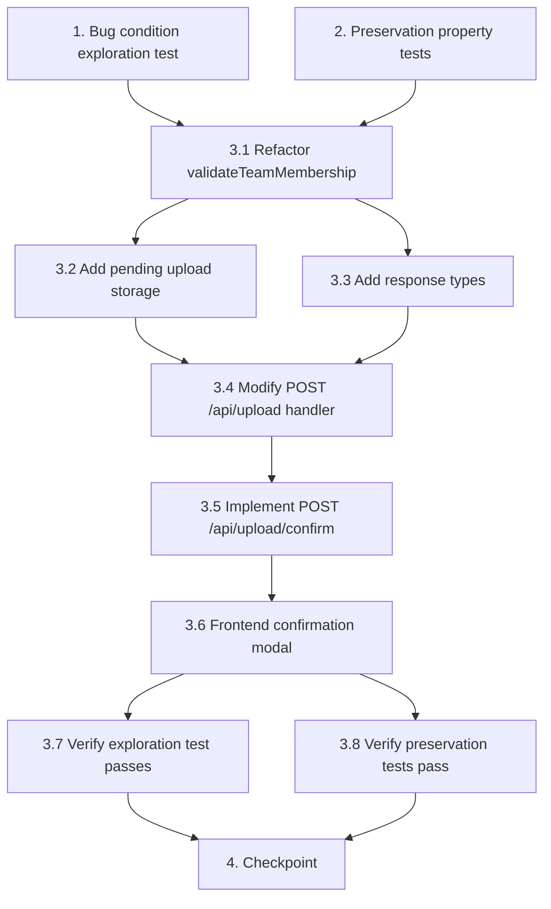

# Implementation Plan

## Overview

This plan fixes the bug where uploading sprint data with unregistered team names results in a hard 400 rejection instead of a 409 confirmation flow. The implementation follows the exploratory bugfix workflow: first write tests to confirm the bug exists, then write preservation tests to lock in existing behavior, implement the fix (refactored validation, pending upload storage, 409 response, confirm endpoint, frontend modal), and finally verify all tests pass.

## Tasks

- [x] 1. Write bug condition exploration test
  - **Property 1: Bug Condition** - New Teams Trigger Hard Rejection Instead of Confirmation
  - **CRITICAL**: This test MUST FAIL on unfixed code - failure confirms the bug exists
  - **DO NOT attempt to fix the test or the code when it fails**
  - **NOTE**: This test encodes the expected behavior - it will validate the fix when it passes after implementation
  - **GOAL**: Surface counterexamples that demonstrate the bug exists
  - **Scoped PBT Approach**: Scope the property to concrete failing cases: uploads containing at least one non-empty Team value not in the registered teams set (isBugCondition returns true), with all other validations passing
  - Bug Condition: `isBugCondition(input)` — at least one non-empty Team value in the uploaded rows does NOT exist in the `teams` table for the EM's function, AND all other validations (format, headers, function, dropdowns, field types) pass
  - Write a property-based test that generates upload payloads with at least one unregistered non-empty team name among otherwise valid rows
  - Assert that `POST /api/upload` returns HTTP 409 with `{ requiresConfirmation: true, newTeams: string[], pendingUploadId: string }`
  - Assert `newTeams` contains exactly all unregistered team names from the upload (no duplicates)
  - Assert `pendingUploadId` is a valid non-empty UUID string
  - Run test on UNFIXED code
  - **EXPECTED OUTCOME**: Test FAILS (current code returns 400 with validation errors instead of 409 — this proves the bug exists)
  - Document counterexamples found (e.g., "Upload with team 'Beta' not registered returns 400 `Team 'Beta' is not registered under the assigned function` instead of 409 confirmation response")
  - Mark task complete when test is written, run, and failure is documented
  - _Requirements: 1.1, 1.2, 1.3, 2.1, 2.2_

- [x] 2. Write preservation property tests (BEFORE implementing fix)
  - **Property 2: Preservation** - Registered Teams Process Immediately Without Confirmation
  - **IMPORTANT**: Follow observation-first methodology
  - Observe: Upload with all registered teams on UNFIXED code → returns 200 with `{ success: true, rowsIngested, uploadId, timestamp }`
  - Observe: Upload with empty/blank Team values on UNFIXED code → returns 400 with "Team is required and cannot be empty"
  - Observe: Upload with invalid file format on UNFIXED code → returns 400 with format errors
  - Observe: Upload with function mismatch on UNFIXED code → returns 400 with function mismatch error
  - Observe: Upload with dropdown/field-type errors on UNFIXED code → returns 400 with row-level errors
  - Write property-based tests generating uploads where `isBugCondition` returns false (all teams registered, or file fails other validations):
    - For all uploads with only registered non-empty teams and valid data, assert response is 200 with `{ success: true, rowsIngested }`
    - For all uploads with empty/blank Team values, assert response is 400 with team-required validation error
    - For all uploads failing format/header/function validation, assert response is 400 with appropriate errors
  - Verify tests PASS on UNFIXED code (confirms baseline behavior to preserve)
  - **EXPECTED OUTCOME**: Tests PASS (this confirms existing behavior before the fix)
  - Mark task complete when tests are written, run, and passing on unfixed code
  - _Requirements: 3.1, 3.2, 3.3, 3.4_

- [x] 3. Fix for new team confirmation on upload

  - [x] 3.1 Refactor `validateTeamMembership` to separate new teams from errors
    - In `server/src/services/upload-validation.service.ts`, modify `validateTeamMembership` to return `{ errors: ValidationError[], newTeams: string[] }`
    - Empty/blank Team values continue to produce hard validation errors in `errors`
    - Non-empty Team values not found in the valid team set are collected into `newTeams` (deduplicated)
    - When all teams are registered, `newTeams` is empty and behavior is unchanged
    - _Bug_Condition: isBugCondition(input) — rows contain non-empty team values NOT IN validTeams set_
    - _Expected_Behavior: Return `{ errors, newTeams }` where newTeams contains unregistered non-empty team names_
    - _Preservation: Empty/blank teams still produce errors; registered teams produce no errors and empty newTeams_
    - _Requirements: 2.1, 2.2, 3.1, 3.2_

  - [x] 3.2 Add pending upload storage mechanism
    - Create a `pending_uploads` table or in-memory cache with TTL to hold `{ id: UUID, rows: ParsedRow[], functionId: number, userId: string, filename: string, newTeams: string[], expiresAt: Date }`
    - Implement create, retrieve, and delete operations for pending uploads
    - Implement automatic expiry cleanup for stale pending uploads
    - _Requirements: 2.1, 2.2, 2.3_

  - [x] 3.3 Add response types for new team confirmation
    - In `server/src/types/api.ts`, add `NewTeamConfirmationResponse { requiresConfirmation: true, newTeams: string[], pendingUploadId: string, message: string }`
    - In `client/src/types/index.ts`, add matching client-side type and update `UploadResult` union to include 409 response handling
    - _Requirements: 2.1, 2.2_

  - [x] 3.4 Modify `POST /api/upload` handler to return 409 for new teams
    - In `server/src/routes/upload.routes.ts`, after all other validations pass (format, headers, function, dropdowns, field types), check if `newTeams.length > 0`
    - If new teams detected: store parsed rows + metadata as a pending upload, return HTTP 409 with `{ requiresConfirmation: true, newTeams, pendingUploadId, message }`
    - If no new teams: continue with existing ingestion logic (200 response)
    - Other validation errors still short-circuit with 400 as before
    - New team detection only applies AFTER all other validations pass (i.e., if there are other errors, return 400 with those errors, not 409)
    - _Bug_Condition: isBugCondition(input) — newTeams.length > 0 after other validations pass_
    - _Expected_Behavior: HTTP 409 with requiresConfirmation, newTeams list, pendingUploadId_
    - _Preservation: Uploads with all registered teams still return 200; other validation failures still return 400_
    - _Requirements: 1.1, 1.2, 1.3, 2.1, 2.2, 3.1, 3.3, 3.4_

  - [x] 3.5 Implement `POST /api/upload/confirm` endpoint
    - Create new route in `server/src/routes/upload.routes.ts` accepting `{ pendingUploadId: string, confirmed: boolean }`
    - If confirmed: retrieve pending upload, create new teams via `TeamRepository.create()` under the EM's function, ingest stored rows, delete pending record, return 200 with `{ success: true, rowsIngested, uploadId, timestamp, teamsCreated: string[] }`
    - If declined: delete pending record without creating teams or ingesting data, return 200 with `{ success: true, cancelled: true }`
    - If pendingUploadId not found or expired: return 410 Gone with appropriate error message
    - _Bug_Condition: User has received a 409 and needs to confirm/decline_
    - _Expected_Behavior: Confirmed → teams created + data ingested; Declined → no side effects_
    - _Preservation: No impact on existing endpoints_
    - _Requirements: 2.3, 2.4_

  - [x] 3.6 Implement frontend confirmation modal in Upload page
    - In `client/src/pages/Upload.tsx`, add a `confirming` state to `UploadState` triggered when API returns 409
    - Render a modal/dialog listing discovered new team names from `newTeams` array
    - Provide "Confirm & Create Teams" button that calls `POST /api/upload/confirm` with `{ pendingUploadId, confirmed: true }`
    - Provide "Cancel Upload" button that calls `POST /api/upload/confirm` with `{ pendingUploadId, confirmed: false }` and resets to idle state
    - On confirm success: transition to success state showing ingestion results + teams created
    - On confirm error: display error message and allow retry or cancel
    - _Requirements: 2.1, 2.2, 2.3, 2.4_

  - [x] 3.7 Verify bug condition exploration test now passes
    - **Property 1: Expected Behavior** - New Teams Trigger Confirmation Flow
    - **IMPORTANT**: Re-run the SAME test from task 1 - do NOT write a new test
    - The test from task 1 encodes the expected behavior (409 response with newTeams and pendingUploadId)
    - When this test passes, it confirms the expected behavior is satisfied
    - Run bug condition exploration test from step 1
    - **EXPECTED OUTCOME**: Test PASSES (confirms bug is fixed — uploads with new teams now return 409 instead of 400)
    - _Requirements: 2.1, 2.2_

  - [x] 3.8 Verify preservation tests still pass
    - **Property 2: Preservation** - Registered Teams Process Immediately Without Confirmation
    - **IMPORTANT**: Re-run the SAME tests from task 2 - do NOT write new tests
    - Run preservation property tests from step 2
    - **EXPECTED OUTCOME**: Tests PASS (confirms no regressions — registered teams still return 200, empty teams still return 400, other validation errors unchanged)
    - Confirm all tests still pass after fix (no regressions)
    - _Requirements: 3.1, 3.2, 3.3, 3.4_

- [x] 4. Checkpoint - Ensure all tests pass
  - Run full test suite (server unit tests, integration tests, client tests)
  - Verify Property 1 (Bug Condition) test passes — new teams trigger 409 confirmation
  - Verify Property 2 (Preservation) tests pass — existing behavior unchanged
  - Verify confirmation flow end-to-end: upload → 409 → confirm → 200 with teams created and data ingested
  - Verify decline flow: upload → 409 → decline → no teams created, no data ingested
  - Verify expired pending upload returns 410 Gone
  - Ensure all tests pass, ask the user if questions arise.

## Task Dependency Graph

```json
{
  "waves": [
    {
      "wave": 1,
      "tasks": ["1", "2"],
      "description": "Write exploration and preservation tests before implementing the fix"
    },
    {
      "wave": 2,
      "tasks": ["3.1", "3.2", "3.3"],
      "description": "Refactor validation service, add pending upload storage, and define response types"
    },
    {
      "wave": 3,
      "tasks": ["3.4"],
      "description": "Modify upload handler to return 409 for new teams"
    },
    {
      "wave": 4,
      "tasks": ["3.5"],
      "description": "Implement confirmation endpoint"
    },
    {
      "wave": 5,
      "tasks": ["3.6"],
      "description": "Implement frontend confirmation modal"
    },
    {
      "wave": 6,
      "tasks": ["3.7", "3.8"],
      "description": "Verify exploration and preservation tests pass after fix"
    },
    {
      "wave": 7,
      "tasks": ["4"],
      "description": "Final checkpoint — ensure all tests pass"
    }
  ]
}
```



## Notes

- The exploration test (task 1) is expected to FAIL on unfixed code — this is intentional and confirms the bug exists. Do not attempt to fix the test when it fails.
- Preservation tests (task 2) must PASS on unfixed code before any implementation begins, establishing the behavioral baseline.
- New team detection only triggers AFTER all other validations pass. If there are format, header, function, or field-type errors, those take precedence and the response is a standard 400.
- The `pendingUploadId` should have a reasonable TTL (e.g., 15 minutes) to avoid accumulating stale records.
- The confirmation endpoint (3.5) must handle race conditions: if the same `pendingUploadId` is confirmed twice, the second call should be idempotent or return an appropriate error.
