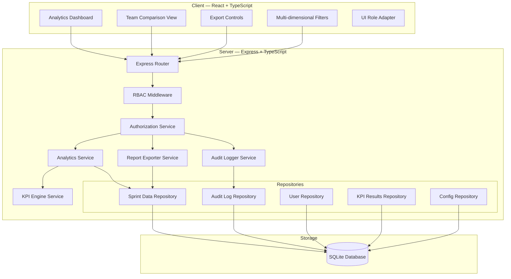
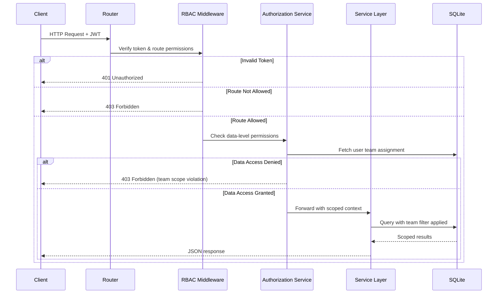
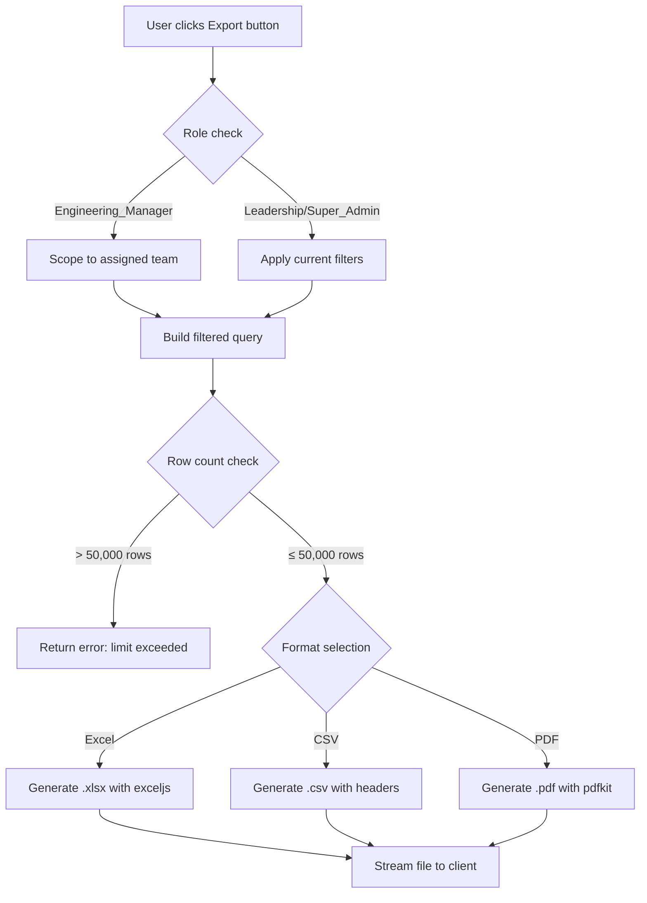

# Design Document: RBAC, Reporting & Analytics

## Overview

This feature extends the Engineering Health & Delivery Governance Platform with three major capabilities:

1. **Enhanced RBAC with team-scoped data isolation** — Extends the existing route-level RBAC middleware to enforce data-level access control. Engineering Managers see only their assigned team's data, Leadership gets read-only cross-team visibility, and Super Admins retain full administrative control.

2. **Analytics Dashboard** — A rich reporting view with KPI scorecards, trend charts, team comparisons, and interactive multi-dimensional filtering (team, engineering manager, date range, development status).

3. **Report Export & Audit Logging** — Server-side generation of Excel, CSV, and PDF exports with role-scoped data, plus immutable audit logging for all data mutations.

### Key Design Decisions

1. **Authorization Service as a separate layer** — Data-level permissions are enforced in a dedicated `AuthorizationService` rather than inlining logic in route handlers. This keeps route code focused on request/response while centralizing permission evaluation.

2. **Team Assignment stored in `users` table** — A `team_id` column is added to the existing `users` table, establishing the one-to-one mapping between Engineering Managers and their teams. This avoids a separate join table for a simple relationship.

3. **Audit log as an append-only table** — A new `audit_logs` table captures all CUD operations. Records are insert-only at the application level (no UPDATE/DELETE exposed), ensuring tamper resistance.

4. **Server-side export generation** — Reports are generated server-side using `exceljs` (Excel), native CSV serialization, and `pdfkit` (PDF). This ensures data scoping is applied at the API layer and exports cannot bypass permissions.

5. **Filter composition via AND logic** — All analytics filters combine with logical AND. The server builds dynamic WHERE clauses from validated filter parameters, reusing the existing `findByFilter` pattern.

6. **Existing libraries preserved** — Uses Recharts for charts, AG Grid for tables, and fast-check for property-based testing, matching the existing project conventions.

---

## Architecture

### Enhanced System Architecture



### Authorization Flow



### Export Generation Flow



---

## Components and Interfaces

### Server-Side Components

#### 1. Authorization Service (`/server/src/services/authorization.service.ts`)

```typescript
interface UserContext {
  userId: string;
  role: 'Engineering_Manager' | 'Leadership' | 'Super_Admin' | 'Admin' | 'Delivery_Manager';
  teamId: string | null;  // null for Leadership and Super_Admin
}

interface AuthorizationResult {
  permitted: boolean;
  scopedTeam: string | null;  // team to filter by, null means all teams
  errorMessage?: string;
}

interface IAuthorizationService {
  /** Check if user can read data for a given team */
  canReadTeamData(user: UserContext, targetTeam: string): AuthorizationResult;
  
  /** Check if user can write (create/edit) data for a given team */
  canWriteTeamData(user: UserContext, targetTeam: string): AuthorizationResult;
  
  /** Check if user can delete data */
  canDeleteData(user: UserContext): AuthorizationResult;
  
  /** Get the data scope for a user (which teams they can see) */
  getDataScope(user: UserContext): DataScope;
  
  /** Check if user can export reports */
  canExportReports(user: UserContext): AuthorizationResult;
  
  /** Check if user can access audit logs */
  canAccessAuditLogs(user: UserContext): AuthorizationResult;
}

interface DataScope {
  type: 'single_team' | 'all_teams';
  teamId: string | null;  // non-null only for single_team
}
```

**Authorization Rules Matrix:**

| Operation | Engineering_Manager | Leadership | Super_Admin |
|-----------|-------------------|------------|-------------|
| Read own team data | ✓ | ✓ | ✓ |
| Read other team data | ✗ (403) | ✓ | ✓ |
| Create sprint entry (own team) | ✓ | ✗ (403) | ✓ |
| Create sprint entry (other team) | ✗ (403) | ✗ (403) | ✓ |
| Edit sprint entry (own team) | ✓ | ✗ (403) | ✓ |
| Edit sprint entry (other team) | ✗ (403) | ✗ (403) | ✓ |
| Delete sprint entry | ✗ (403) | ✗ (403) | ✓ |
| Upload data | ✓ (own team) | ✗ (403) | ✓ |
| Export reports | ✓ (own team) | ✓ (all) | ✓ (all) |
| View audit logs | ✗ (403) | ✗ (403) | ✓ |
| Team comparison view | ✗ | ✓ | ✓ |

#### 2. Analytics Service (`/server/src/services/analytics.service.ts`)

```typescript
interface AnalyticsFilter {
  team?: string;
  engineeringManager?: string;
  startDate?: string;
  endDate?: string;
  developmentStatus?: string;
  period?: 'month' | 'quarter' | 'year' | 'custom';
}

interface KpiScorecard {
  kpis: KpiResult[];
  periodLabel: string;
  scope: string;  // team name or "Organization"
}

interface TeamComparisonRow {
  team: string;
  kpis: Record<KpiName, { value: number | null; ragStatus: RagStatus }>;
}

interface TrendDataPoint {
  period: string;
  value: number | null;
  ragStatus: RagStatus;
}

interface IAnalyticsService {
  /** Get KPI scorecard for current filters and scope */
  getScorecard(filter: AnalyticsFilter, userScope: DataScope): Promise<KpiScorecard>;
  
  /** Get team comparison data (Leadership/Super_Admin only) */
  getTeamComparison(filter: AnalyticsFilter): Promise<TeamComparisonRow[]>;
  
  /** Get trend data for a KPI over time */
  getTrends(kpiName: KpiName, filter: AnalyticsFilter, userScope: DataScope): Promise<TrendDataPoint[]>;
  
  /** Get historical trend lines for multiple KPIs */
  getHistoricalTrends(filter: AnalyticsFilter, userScope: DataScope): Promise<Record<KpiName, TrendDataPoint[]>>;
}
```

#### 3. Report Exporter Service (`/server/src/services/report-exporter.service.ts`)

```typescript
type ExportFormat = 'xlsx' | 'csv' | 'pdf';

interface ExportRequest {
  format: ExportFormat;
  filter: AnalyticsFilter;
  userScope: DataScope;
  requestedBy: string;
  requestedAt: string;
}

interface ExportResult {
  buffer: Buffer;
  filename: string;
  mimeType: string;
}

interface IReportExporterService {
  /** Generate an export file based on format and filtered data */
  generateExport(request: ExportRequest): Promise<ExportResult>;
  
  /** Validate that the export won't exceed size limits */
  validateExportSize(filter: AnalyticsFilter, userScope: DataScope): Promise<{ valid: boolean; rowCount: number }>;
}
```

**Export Format Specifications:**

| Format | Library | Content | MIME Type |
|--------|---------|---------|-----------|
| Excel (.xlsx) | exceljs | Filtered data with column headers, auto-width columns | `application/vnd.openxmlformats-officedocument.spreadsheetml.sheet` |
| CSV (.csv) | Native | Comma-separated values with header row, UTF-8 BOM | `text/csv` |
| PDF (.pdf) | pdfkit + pdfkit-table | Formatted table with title, timestamp, filter summary | `application/pdf` |

#### 4. Audit Logger Service (`/server/src/services/audit-logger.service.ts`)

```typescript
type AuditAction = 'create' | 'update' | 'delete';

interface AuditEntry {
  id?: number;
  userId: string;
  action: AuditAction;
  recordId: number;
  recordType: 'sprint_data';
  teamId: string;
  modifiedFields: string[] | null;  // null for create/delete, field names for update
  timestamp: string;  // UTC ISO 8601
}

interface AuditFilter {
  userId?: string;
  action?: AuditAction;
  startDate?: string;
  endDate?: string;
  teamId?: string;
}

interface IAuditLoggerService {
  /** Log a data mutation event */
  log(entry: Omit<AuditEntry, 'id' | 'timestamp'>): Promise<void>;
  
  /** Query audit log entries with filters */
  query(filter: AuditFilter, limit?: number, offset?: number): Promise<AuditEntry[]>;
  
  /** Get audit history for a specific record */
  getRecordHistory(recordId: number): Promise<AuditEntry[]>;
}
```

#### 5. Enhanced RBAC Middleware (`/server/src/middleware/rbac.ts`)

The existing middleware is extended to include `teamId` in the decoded user context:

```typescript
interface AuthenticatedRequest extends Request {
  user: {
    userId: string;
    role: string;
    teamId: string | null;
  };
}
```

The `teamId` is fetched from the `users` table during token verification and attached to the request context. This avoids an extra DB lookup on every data-access request.

### Client-Side Components

#### 1. Analytics Dashboard Page (`/client/src/pages/Analytics.tsx`)

- KPI Scorecard section: 9 tiles with value, RAG badge, percent change
- Trend charts section: Line charts per KPI using Recharts
- Team comparison table (Leadership/Super_Admin only): AG Grid with team rows and KPI columns
- Interactive filter panel at top

#### 2. Enhanced Filter Panel (`/client/src/components/AnalyticsFilterBar.tsx`)

Extended filter bar with additional dimensions:

| Filter | Control Type | Available To |
|--------|-------------|--------------|
| Team | Dropdown (multi-select) | Leadership, Super_Admin |
| Engineering Manager | Dropdown | Leadership, Super_Admin |
| Time Period | Segmented control (Month/Quarter/Year) | All roles |
| Custom Date Range | Date picker pair | Leadership, Super_Admin |
| Development Status | Dropdown | All roles |

#### 3. UI Role Adapter (`/client/src/components/RoleAdapter.tsx`)

A wrapper component that conditionally renders UI elements based on the authenticated user's role:

```typescript
interface RoleAdapterProps {
  allowedRoles: string[];
  children: React.ReactNode;
  fallback?: React.ReactNode;
}
```

#### 4. Export Controls (`/client/src/components/ExportControls.tsx`)

Renders export buttons (Excel, CSV, PDF) for Leadership and Super_Admin users. Triggers download via API call with current filter state.

### New API Endpoints

| Method | Path | Role(s) | Description |
|--------|------|---------|-------------|
| GET | `/api/analytics/scorecard` | EM, Leadership, Super_Admin | Get KPI scorecard for current scope |
| GET | `/api/analytics/comparison` | Leadership, Super_Admin | Get team comparison data |
| GET | `/api/analytics/trends` | EM, Leadership, Super_Admin | Get trend data for charts |
| GET | `/api/analytics/historical` | EM, Leadership, Super_Admin | Get historical performance trends |
| POST | `/api/reports/export` | EM, Leadership, Super_Admin | Generate and download export file |
| GET | `/api/audit-logs` | Super_Admin | Query audit log entries |
| GET | `/api/audit-logs/record/:id` | Super_Admin | Get audit history for a record |
| GET | `/api/users/me` | All authenticated | Get user profile with team assignment |
| PUT | `/api/admin/users/:id/team` | Super_Admin | Reassign user to different team |

---

## Data Models

### New Database Tables

```sql
-- Audit log (append-only)
CREATE TABLE audit_logs (
  id INTEGER PRIMARY KEY AUTOINCREMENT,
  user_id TEXT NOT NULL,
  action TEXT CHECK(action IN ('create', 'update', 'delete')) NOT NULL,
  record_id INTEGER NOT NULL,
  record_type TEXT NOT NULL DEFAULT 'sprint_data',
  team_id TEXT NOT NULL,
  modified_fields TEXT,  -- JSON array of field names, NULL for create/delete
  timestamp TEXT NOT NULL DEFAULT (strftime('%Y-%m-%dT%H:%M:%fZ', 'now'))
);

CREATE INDEX idx_audit_logs_user ON audit_logs(user_id);
CREATE INDEX idx_audit_logs_record ON audit_logs(record_id);
CREATE INDEX idx_audit_logs_team ON audit_logs(team_id);
CREATE INDEX idx_audit_logs_timestamp ON audit_logs(timestamp);
CREATE INDEX idx_audit_logs_action ON audit_logs(action);
```

### Modified Tables

```sql
-- Add team_id column to users table
ALTER TABLE users ADD COLUMN team_id TEXT;

-- Add index for user team lookups
CREATE INDEX idx_users_team ON users(team_id);
```

### New TypeScript Types

```typescript
/** Extended user with team assignment */
interface UserWithTeam {
  id: string;
  username: string;
  role: 'Admin' | 'Engineering_Manager' | 'Delivery_Manager' | 'Leadership' | 'Super_Admin';
  teamId: string | null;
  token: string;
}

/** Audit log entry */
interface AuditLogEntry {
  id: number;
  userId: string;
  action: 'create' | 'update' | 'delete';
  recordId: number;
  recordType: string;
  teamId: string;
  modifiedFields: string[] | null;
  timestamp: string;
}

/** Analytics filter extending KpiFilter */
interface AnalyticsFilter {
  team?: string;
  engineeringManager?: string;
  startDate?: string;
  endDate?: string;
  developmentStatus?: string;
  period?: 'month' | 'quarter' | 'year' | 'custom';
}

/** Team comparison data */
interface TeamComparisonRow {
  team: string;
  kpis: Record<KpiName, { value: number | null; ragStatus: RagStatus }>;
}

/** Export request parameters */
interface ExportRequest {
  format: 'xlsx' | 'csv' | 'pdf';
  filter: AnalyticsFilter;
}
```

### Validation Schemas (Zod)

```typescript
const analyticsFilterSchema = z.object({
  team: z.string().optional(),
  engineeringManager: z.string().optional(),
  startDate: z.string().regex(/^\d{4}-\d{2}-\d{2}$/).optional(),
  endDate: z.string().regex(/^\d{4}-\d{2}-\d{2}$/).optional(),
  developmentStatus: z.string().optional(),
  period: z.enum(['month', 'quarter', 'year', 'custom']).optional(),
}).refine(
  (data) => {
    if (data.startDate && data.endDate) {
      return data.startDate <= data.endDate;
    }
    return true;
  },
  { message: 'End date must not be before start date' }
);

const exportRequestSchema = z.object({
  format: z.enum(['xlsx', 'csv', 'pdf']),
  filter: analyticsFilterSchema,
});

const auditLogFilterSchema = z.object({
  userId: z.string().optional(),
  action: z.enum(['create', 'update', 'delete']).optional(),
  startDate: z.string().regex(/^\d{4}-\d{2}-\d{2}$/).optional(),
  endDate: z.string().regex(/^\d{4}-\d{2}-\d{2}$/).optional(),
  teamId: z.string().optional(),
});
```


---

## Correctness Properties

*A property is a characteristic or behavior that should hold true across all valid executions of a system — essentially, a formal statement about what the system should do. Properties serve as the bridge between human-readable specifications and machine-verifiable correctness guarantees.*

### Property 1: Engineering Manager Data Isolation

*For any* Engineering Manager with a team assignment T, and *for any* API request targeting data belonging to a team T' where T' ≠ T, the Authorization Service SHALL deny the request with a 403 response. Conversely, *for any* read or permitted write request targeting team T, the Authorization Service SHALL permit the request.

**Validates: Requirements 1.3, 1.5, 1.6, 1.7, 6.2, 6.5, 6.6**

### Property 2: Leadership Write Denial

*For any* Leadership user and *for any* write operation (create, edit, or delete) targeting *any* sprint data record regardless of team, the Authorization Service SHALL deny the operation with a 403 Forbidden response.

**Validates: Requirements 3.2, 6.5**

### Property 3: Engineering Manager Delete Denial

*For any* Engineering Manager and *for any* delete request targeting *any* sprint data record (including records belonging to their own assigned team), the Authorization Service SHALL deny the operation with a 403 Forbidden response.

**Validates: Requirements 2.6**

### Property 4: Super Admin Full Access

*For any* Super Admin user and *for any* CRUD operation (create, read, update, delete) targeting *any* sprint data record belonging to *any* team, the Authorization Service SHALL permit the operation.

**Validates: Requirements 4.1**

### Property 5: Team Reassignment Immediacy

*For any* Engineering Manager reassigned from team T1 to team T2, the very next authorization check after the reassignment SHALL scope data access to T2 (granting access to T2 data and denying access to T1 data).

**Validates: Requirements 4.4, 6.7**

### Property 6: Audit Log Completeness

*For any* sprint data mutation (create, update, or delete) performed by *any* user, the audit log SHALL contain an entry with the correct user identifier, the correct action type, the correct record identifier, and a valid UTC timestamp that is not in the future.

**Validates: Requirements 5.1, 5.2, 5.3**

### Property 7: Audit Log Modified Fields Accuracy

*For any* sprint data update operation that modifies a set of fields F, the corresponding audit log entry SHALL contain a `modifiedFields` value that is exactly equal to F (no missing fields, no extra fields).

**Validates: Requirements 5.2**

### Property 8: Audit Log Filter Correctness

*For any* combination of audit log filter parameters (userId, action, dateRange, teamId), every entry returned by the audit log query SHALL satisfy all active filter conditions, and no matching entry SHALL be omitted from the results.

**Validates: Requirements 5.4**

### Property 9: Audit Log Chronological Ordering

*For any* sprint data record with multiple audit events, querying the record's audit history SHALL return entries ordered by timestamp ascending (chronological order), such that for consecutive entries entry[i].timestamp ≤ entry[i+1].timestamp.

**Validates: Requirements 5.6**

### Property 10: 403 Response Format Consistency

*For any* API request that fails authorization (either role-based or team-scoped), the response SHALL have HTTP status 403 and a JSON body containing an `error` field with a non-empty string message.

**Validates: Requirements 6.3, 6.4**

### Property 11: Period-to-Date-Range Conversion

*For any* valid month M in year Y, the period converter SHALL produce a date range starting on Y-M-01 and ending on the last day of month M. *For any* valid quarter Q in year Y, the converter SHALL produce a range spanning the correct 3-month period (Q1: Jan 1 – Mar 31, Q2: Apr 1 – Jun 30, Q3: Jul 1 – Sep 30, Q4: Oct 1 – Dec 31). *For any* valid year Y, the converter SHALL produce a range from Jan 1 to Dec 31.

**Validates: Requirements 8.3, 8.4, 8.5**

### Property 12: Custom Date Range Inclusive Filtering

*For any* dataset and *for any* custom date range [startDate, endDate], all records returned by the filter SHALL have their date field ≥ startDate AND ≤ endDate, and no records within that range SHALL be omitted.

**Validates: Requirements 8.6**

### Property 13: Date Range Validation Rejection

*For any* date pair where endDate < startDate, the analytics filter validation SHALL reject the input and return a validation error without executing any data query.

**Validates: Requirements 8.7**

### Property 14: KPI Scorecard Completeness

*For any* valid analytics filter and user scope, the scorecard endpoint SHALL return exactly 9 KPI entries (one per defined KPI), each containing a kpiName, a value (number or null), and a ragStatus from the set {green, amber, red}.

**Validates: Requirements 9.1**

### Property 15: Export Data Round-Trip

*For any* filtered dataset exported to Excel (.xlsx) or CSV (.csv) format, parsing the exported file back into structured rows SHALL produce a dataset identical to the server query results (same number of rows, same column headers, same cell values).

**Validates: Requirements 10.1, 10.2**

### Property 16: Export Scope Consistency

*For any* user and *for any* active filter state, the data contained in an export file SHALL be exactly equal to the data returned by the analytics dashboard API with the same filter and user scope applied. No additional records and no missing records.

**Validates: Requirements 10.4, 10.6**

### Property 17: Filter AND Composition

*For any* dataset and *for any* combination of active filters (team, engineeringManager, dateRange, developmentStatus), every record returned by the analytics query SHALL satisfy ALL active filter conditions simultaneously. No record violating any single condition SHALL appear in the results.

**Validates: Requirements 11.2, 11.3, 11.4, 11.5**

### Property 18: Trend Consecutive Period Coverage

*For any* time range spanning N complete periods (months or quarters), the trend data response SHALL contain exactly N data points with no gaps between consecutive periods. Each data point SHALL correspond to exactly one period in chronological order.

**Validates: Requirements 9.5, 12.1, 12.2**

### Property 19: Multi-Team Trend Series

*For any* set of K selected teams, the multi-team trend response SHALL contain exactly K distinct series (one per team), each with the same number of period data points covering the same time range.

**Validates: Requirements 12.4**

### Property 20: Historical Records Ordering

*For any* set of sprint data records belonging to a team, when queried for historical display, the records SHALL be returned in descending order by ingestion date such that for consecutive results result[i].ingestedAt ≥ result[i+1].ingestedAt.

**Validates: Requirements 2.4**

---

## Error Handling

### Authorization Error Responses

| Error Category | HTTP Status | Response Format | Trigger |
|---|---|---|---|
| Missing/invalid JWT token | 401 | `{ error: "Authentication required..." }` | No token, malformed, expired |
| Route-level role denial | 403 | `{ error: "Forbidden. Insufficient permissions..." }` | Role not in route's allowed list |
| Team-scope violation | 403 | `{ error: "Access denied. You do not have permission to access this team's data." }` | EM accessing another team |
| Write operation denied | 403 | `{ error: "Forbidden. Your role does not permit this operation." }` | Leadership attempting write |
| Delete denied for EM | 403 | `{ error: "Forbidden. Engineering Managers cannot delete records." }` | EM attempting delete |

### Analytics & Export Errors

| Error Category | HTTP Status | Response Format | Trigger |
|---|---|---|---|
| Invalid date range (end < start) | 400 | `{ success: false, errors: [{ field: "endDate", message }] }` | Validation failure |
| Invalid filter parameters | 400 | `{ success: false, errors: [...] }` | Zod validation failure |
| Export size limit exceeded | 400 | `{ success: false, error: "Export limit exceeded. Maximum 50,000 rows. Please apply additional filters." }` | Row count > 50,000 |
| Insufficient data for trends | 200 | `{ success: true, data: null, insufficientData: true, message: "..." }` | < 2 data points |
| Export generation failure | 500 | `{ error: "Failed to generate export. Please try again." }` | Library error |
| Audit log query failure | 500 | `{ error: "Internal server error" }` | Database error |

### Audit Logging Error Handling

- Audit log writes MUST NOT fail silently. If an audit log insert fails, the originating data mutation transaction MUST be rolled back.
- Audit log failures are logged to the server error log with full context.
- Audit log entries are immutable — no UPDATE or DELETE endpoints are exposed.

### Client-Side Error Handling

| Scenario | User Experience |
|---|---|
| 403 on data access | Banner: "You don't have permission to view this data" |
| 403 on write attempt | Toast: "Your role does not allow this action" |
| Export size limit | Modal: "Too many records to export. Please narrow your filters." |
| No data for selected filters | Empty state illustration with "No data matches your current filters" |
| Insufficient trend data | Chart placeholder: "Not enough data points for trend analysis" |
| Network timeout on export | Toast with retry: "Export timed out. Please try again." |

---

## Testing Strategy

### Frameworks and Libraries

| Layer | Framework | Libraries |
|-------|-----------|-----------|
| Server unit tests | Vitest | vitest, supertest, better-sqlite3 (in-memory) |
| Server property tests | Vitest + fast-check | fast-check for property-based testing |
| Client unit tests | Vitest | @testing-library/react, jsdom |
| Integration tests | Vitest | supertest, in-memory SQLite |

### Property-Based Testing Configuration

- **Library**: fast-check (already in server devDependencies)
- **Minimum iterations**: 100 per property test
- **Tag format**: `Feature: rbac-reporting-analytics, Property {N}: {title}`
- **Location**: `/server/src/__tests__/properties/rbac-analytics/`
- **Each property** from the Correctness Properties section maps to a single `fc.assert(fc.property(...))` test

### Generator Strategy

| Property Group | Generator Approach |
|---|---|
| Authorization (P1-P5) | Random user contexts (role, teamId), random target teams, random operations (CRUD) |
| Audit logging (P6-P9) | Random sprint data mutations with random field subsets, random user IDs, random timestamps |
| Date/Period (P11-P13) | Random months (1-12), quarters (1-4), years (2020-2030), random date pairs |
| Filter composition (P17) | Random datasets of 5-50 rows with varied team/status/date values, random filter combinations |
| Export round-trip (P15-P16) | Random filtered datasets of 1-100 rows, verify serialization/deserialization |
| Trend coverage (P18-P19) | Random time ranges (3-24 months), random team counts (1-10) |
| Ordering (P9, P20) | Random lists of timestamped entries, verify sort invariant |

### Unit Test Coverage Areas

- Authorization Service: specific examples for each role × operation × team combination
- Report Exporter: edge cases (empty dataset, single row, special characters in data, max column widths)
- Audit Logger: specific mutation scenarios, concurrent writes
- Period converter: boundary months (January, December), leap years, Q4 edge cases
- Filter validation: empty strings, null values, SQL injection attempts

### Integration Test Coverage

- Full request cycle: authenticate → filter → export → verify file contents
- Team reassignment: reassign EM → verify immediate scope change on next request
- Audit trail: create → update → delete → verify audit history complete
- Performance: verify scorecard and comparison endpoints respond within 3 seconds for typical datasets
- Export limits: verify 50,000 row cap with appropriate error

### Test Organization

```
server/src/__tests__/
├── properties/
│   └── rbac-analytics/
│       ├── authorization.property.test.ts    (P1-P5, P10)
│       ├── audit-logging.property.test.ts    (P6-P9)
│       ├── date-period.property.test.ts      (P11-P13)
│       ├── filter-composition.property.test.ts (P17)
│       ├── export-roundtrip.property.test.ts (P15-P16)
│       ├── trend-coverage.property.test.ts   (P18-P19)
│       └── ordering.property.test.ts         (P20)
├── unit/
│   ├── authorization.service.test.ts
│   ├── analytics.service.test.ts
│   ├── report-exporter.service.test.ts
│   ├── audit-logger.service.test.ts
│   └── period-converter.test.ts
└── integration/
    ├── rbac-flow.integration.test.ts
    ├── export-flow.integration.test.ts
    └── audit-flow.integration.test.ts
```
